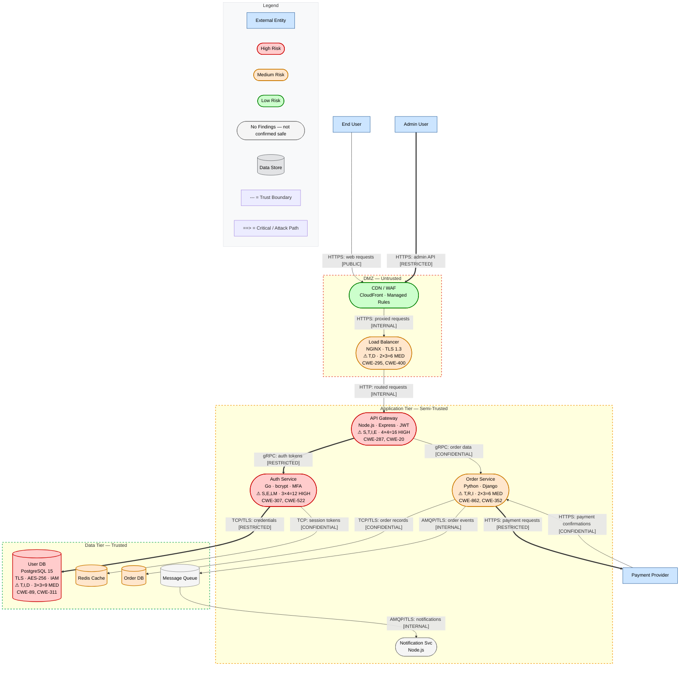

# Mermaid Diagram Conventions for Threat Models

## Contents
- **Diagram Design Principles** — aesthetics, visual hierarchy, information density
- **Rendering Configuration** — high-quality PNG/SVG output settings
- Component Shapes
- Two-Pass Diagram Approach (Pass 1 Structural, Pass 2 Risk Overlay)
- Trust Boundaries
- Data Flow Labels
- Arrow Syntax Reference
- Color Coding with classDef
- Threat Annotations (Enriched Node Labels)
- Component Metadata (Enriched Node Labels)
- Diagram Legends (Structural, Risk-Overlay)
- Full Example
- Extended Visual Categories
- Network Zones (detailed)
- Category Applicability Guide
- Common Pitfalls

---

## Diagram Design Principles

These diagrams are the visual centerpiece of the security assessment. They appear in executive presentations, web reports, and printed documents. They must be both **technically precise** and **visually compelling**.

### Visual Hierarchy

1. **Size signals importance**: High-risk components should have longer, more descriptive labels. External-facing components sit at the top (TD) or left (LR) — where the eye starts.
2. **Color signals risk**: The classDef palette is carefully designed — reds draw attention to danger, greens recede. Let the color system do the communication work.
3. **Grouping signals relationships**: Use subgraphs liberally. Components that share a trust zone, network segment, or deployment unit should be visually grouped. This creates "zones" the eye can parse quickly.
4. **Flow direction signals data movement**: Top-to-bottom (TD) for most systems. Left-to-right (LR) only for clear pipeline architectures. Never mix directions without strong reason.

### Information Density

Diagrams should be **information-rich, not sparse**. A threat model diagram with 5 bare nodes and 4 unlabeled arrows is useless. Every element should carry security-relevant context:

- **Node labels**: Include component name + key technology + security-relevant metadata. Use `\n` for multi-line labels.
  ```
  API(["API Gateway\nNode.js · Express\nJWT · Rate Limited"])
  ```
- **Edge labels**: Always include protocol, data type, sensitivity, and encryption state.
  ```
  -->|"HTTPS: auth tokens [RESTRICTED] [ENC]"|
  ```
- **Subgraph labels**: Include trust level, network CIDR, or data classification.
  ```
  subgraph PrivateSubnets["Private Subnets — 10.0.2.0/24 — Semi-Trusted"]
  ```

### Aesthetic Guidelines

1. **Consistent spacing**: Keep parallel data flows at similar lengths. Avoid one edge spanning the entire diagram while another is tiny.
2. **Minimize edge crossings**: Reorder nodes within subgraphs to reduce crossing lines. If crossings are unavoidable, the more important flow should be the straighter one.
3. **Label readability**: Keep node labels to 2-4 lines max. Edge labels to 1 line. If more detail is needed, put it in companion metadata tables in the report.
4. **Visual breathing room**: Don't cram 30 nodes into one subgraph. Split large zones into logical sub-zones.
5. **Legend placement**: Put the legend in its own subgraph at the bottom. It should be complete but not dominant.
6. **Professional feel**: These diagrams go to CISOs and board members. No sloppy layouts, no orphaned nodes, no generic labels like "Server" or "DB". Every node should be identifiable by name.

### Risk Overlay Enrichment (Phase 7 Only)

In the risk overlay pass, node labels should be enriched with risk summary data:

```
API(["API Gateway\nNode.js · Express\n⚠ S,T,I,E · 4×4=16 HIGH\nCWE-287, CWE-20"]):::highRisk
```

Format: `Component Name\nTech Stack\n⚠ STRIDE · LxI=Score BAND\nTop CWEs`

This replaces the `note right of` syntax (which is NOT valid in flowchart mode and causes CLI rendering failures). By embedding risk data directly in the node label, the information stays visible in ALL output formats — HTML, PNG, DOCX, PDF, PPTX.

---

## Rendering Configuration

Use the rendering config at `references/mermaid-config.json` for all Mermaid PNG/SVG output. This config provides:
- Professional sans-serif fonts at readable sizes
- Smooth `basis` curve for edges (not angular)
- Generous node/rank spacing for readability
- Semi-transparent edge label backgrounds
- Proper padding and diagram margins

### CLI Rendering Command

```bash
npx -y @mermaid-js/mermaid-cli \
  -i {file}.mmd \
  -o {file}.png \
  -c /path/to/references/mermaid-config.json \
  -w 3000 \
  -b white \
  --scale 2
```

**Key parameters**:
- `-c mermaid-config.json` — applies the theme, fonts, spacing
- `-w 3000` — 3000px wide for high-resolution output (zoomable in documents)
- `--scale 2` — 2x pixel density for retina/print quality
- `-b white` — clean white background

### Pre-Processing Before Rendering

The Mermaid CLI is stricter than mermaid.js in the browser. Before rendering to PNG, strip:
1. `~~>` wavy arrows → replace with `==>` thick arrows + `linkStyle N stroke:#cc0000,stroke-width:3px`
2. `note` directives → remove entirely (metadata should be in enriched node labels instead)
3. Unescaped special characters in labels → wrap in double quotes
4. Deeply nested subgraphs (3+ levels) → flatten where possible

### HTML Rendering (mermaid.js CDN)

For the HTML web report, use mermaid.js CDN with this initialization:
```javascript
mermaid.initialize({
  startOnLoad: true,
  theme: 'base',
  themeVariables: {
    primaryColor: '#f5f5f5',
    primaryTextColor: '#1a1a2e',
    lineColor: '#4a4a6a',
    fontSize: '15px',
    fontFamily: "'Segoe UI', 'Helvetica Neue', Arial, sans-serif",
    edgeLabelBackground: '#ffffffee'
  },
  flowchart: { useMaxWidth: false, curve: 'basis', padding: 24 },
  securityLevel: 'loose'
});
```

`securityLevel: 'loose'` enables click handlers for interactive features (zoom, pan, fullscreen).

## Component Shapes

Use consistent shapes to distinguish component types at a glance.

| Component Type | Mermaid Syntax | Example |
|---------------|---------------|---------|
| External Entity (actor, third-party) | `[Text]` rectangle | `User[End User]` |
| Process (application, service) | `([Text])` stadium/rounded | `API([API Gateway])` |
| Data Store (database, cache, file) | `[(Text)]` cylinder | `DB[(User Database)]` |
| Decision / Gateway | `{Text}` diamond | `AuthCheck{Auth Valid?}` |

## Two-Pass Diagram Approach

The threat model produces the architecture diagram in two phases to prevent risk assessment from biasing the structural representation.

### Pass 1 — Structural Diagram (Phase 2)

Purpose: Accurately represent the system architecture before analysis introduces bias.

- All processes use a single neutral style: `:::neutral`
- External entities use `:::external` (external is a structural distinction, not a risk judgment)
- Data stores use `:::dataStore`
- Trust boundaries drawn as dashed subgraphs (structural fact)
- Data flow labels include protocol, data type, and sensitivity classification (factual)
- Component metadata notes document tech stack, auth, encryption (factual observations)
- **NO** `highRisk`, `medRisk`, or `lowRisk` classes applied
- **NO** threat annotation notes
- Legend shows only structural elements

### Pass 2 — Risk Overlay (Phase 7)

Purpose: Visualize validated risk assessment on the structural diagram after analysis is complete.

- Start from the Pass 1 diagram
- Replace `:::neutral` with risk-based classes (`:::highRisk`, `:::medRisk`, `:::lowRisk`) based on validated findings
- Components with **no identified threats** remain `:::noFindings` — absence of findings does NOT equal low risk; it may mean insufficient analysis
- Add threat annotation notes with: STRIDE-LM categories, OWASP Risk Rating score (LxI=Score BAND), top CWE IDs
- Update legend to include risk color meanings
- Use `==>` (thick arrows) to highlight critical data flows identified during analysis
- Add a note explaining that grey (`noFindings`) means "no validated findings," not "confirmed safe"

## Trust Boundaries

Represent trust boundaries as subgraphs with dashed borders. Trust boundaries are structural facts and appear in **both passes**.

```mermaid
subgraph DMZ["DMZ — Low Trust"]
    style DMZ stroke:#e74c3c,stroke-width:2px,stroke-dasharray: 5 5
    LB([Load Balancer])
end

subgraph AppTier["Application Tier — Medium Trust"]
    style AppTier stroke:#f39c12,stroke-width:2px,stroke-dasharray: 5 5
    API([API Server])
end

subgraph DataTier["Data Tier — High Trust"]
    style DataTier stroke:#27ae60,stroke-width:2px,stroke-dasharray: 5 5
    DB[(Primary Database)]
end
```

## Data Flow Labels

Label every arrow with protocol, data type, and sensitivity. This is factual metadata and appears in **both passes**.

Format: `"Protocol: data type [SENSITIVITY]"`

Examples:
- `-->|"HTTPS: JSON credentials [RESTRICTED]"|`
- `-->|"gRPC/mTLS: order events [CONFIDENTIAL]"|`
- `-->|"TCP/TLS: SQL queries [INTERNAL]"|`
- `-->|"HTTPS: public content [PUBLIC]"|`

## Arrow Syntax Reference

| Syntax | Meaning | Use In |
|--------|---------|--------|
| `-->` | Standard data flow (data plane) | Both passes |
| `-.->` | Control plane / optional / async flow | Both passes |
| `==>` | Critical/high-sensitivity flow | Risk overlay only |
| `-->\|"label"\|` | Labeled flow | Both passes |

**Arrow semantics by pass:**

- **Structural pass**: `-->` for data plane flows, `-.->` for control plane flows. Prefix labels with `[DP]` or `[CP]` to distinguish. Do not use `==>`.
- **Risk overlay pass**: Add `==>` for critical flows. For attack paths, use `==>` with `linkStyle` red coloring (see Attack Paths section). Retain all structural arrows.

Note: `==>` (thick arrow) should only be used in the risk overlay pass to highlight critical data flows and attack paths. **DO NOT use `~~>` (wavy arrow)** — it is not valid Mermaid syntax and causes rendering failures. Use `==>` with `linkStyle` instead.

## Color Coding with classDef

Define all `classDef` styles at the **end** of the diagram, after all nodes and edges.

```mermaid
%% Structural pass (Phase 2) — core component types
classDef neutral fill:#f5f5f5,stroke:#666,stroke-width:1px,color:#000
classDef external fill:#cce5ff,stroke:#004085,stroke-width:1px,color:#000
classDef dataStore fill:#e2e3e5,stroke:#383d41,stroke-width:1px,color:#000

%% Structural pass (Phase 2) — extended categories
classDef identity fill:#d4e6f1,stroke:#2980b9,stroke-width:1px,color:#000
classDef secrets fill:#f9e79f,stroke:#f39c12,stroke-width:2px,color:#000
classDef control fill:#abebc6,stroke:#27ae60,stroke-width:1px,color:#000
classDef pipeline fill:#d5dbdb,stroke:#7f8c8d,stroke-width:1px,color:#000
classDef externalDep fill:#f5f5f5,stroke:#333,stroke-width:3px,stroke-dasharray:3,color:#000
classDef outOfScope fill:#eee,stroke:#999,stroke-width:1px,stroke-dasharray:5,color:#666

%% Risk overlay (Phase 7)
classDef highRisk fill:#ffcccc,stroke:#cc0000,stroke-width:2px,color:#000
classDef medRisk fill:#ffe6cc,stroke:#cc7a00,stroke-width:2px,color:#000
classDef lowRisk fill:#ccffcc,stroke:#008000,stroke-width:2px,color:#000
classDef noFindings fill:#f5f5f5,stroke:#666,stroke-width:1px,color:#000

%% Risk overlay — attack path styling
classDef attackPath stroke:#cc0000,stroke-width:3px,color:#cc0000
```

Key distinction: `noFindings` (grey) is used in Pass 2 for components where no threats were validated. `lowRisk` (green) is used only when analysis explicitly confirms low risk. They are semantically different even though `noFindings` shares the same visual as `neutral`.

## Threat Annotations (Risk Overlay Only)

Embed threat data directly in enriched node labels. **DO NOT use `note right of` syntax** — it is NOT valid in flowchart diagrams and causes CLI rendering failures.

**Risk-annotated node format (Phase 7 only):**

```mermaid
API(["API Gateway\nNode.js · Express\n⚠ S,T,I,E · 4×4=16 HIGH\nCWE-287, CWE-20"]):::highRisk
Auth(["Auth Service\nGo · bcrypt · MFA\n⚠ S,E,LM · 3×4=12 HIGH\nCWE-307, CWE-522"]):::highRisk
OrderSvc(["Order Service\nPython · Django\n⚠ T,R,I · 2×3=6 MED\nCWE-862"]):::medRisk
NotifSvc(["Notification Svc\nNode.js"]):::noFindings
```

Pattern: `Name\nTech · Key Security Feature\n⚠ STRIDE · LxI=Score BAND\nTop CWEs`

Components with no findings keep a simpler label (name + tech only) and use `:::noFindings`.

## Component Metadata (Enriched Node Labels)

Embed component metadata directly in node labels using multi-line syntax. These are factual observations and appear in **both passes**. **DO NOT use `note` blocks** — they are invalid in flowchart mode.

**Structural pass (Phase 2) — metadata in labels:**

```mermaid
DB[("User Database\nPostgreSQL 15\nTLS · AES-256 · IAM auth")]:::dataStore
API(["API Gateway\nNode.js · Express\nJWT · Rate Limited 1000/min"]):::neutral
LB(["Load Balancer\nNGINX · TLS 1.3\nNo WAF rules"]):::neutral
```

Pattern: `Name\nTech · Version\nSecurity Features`

Keep to 2-3 lines max. Put detailed metadata (ports, CIDR, security group rules) in companion tables in the report, not in diagram labels.

## Diagram Legends

### Structural Legend (Phase 2)

```mermaid
subgraph Legend
    style Legend fill:#f8f9fa,stroke:#dee2e6
    L1[External Entity]:::external
    L2([Process]):::neutral
    L3[(Data Store)]:::dataStore
    L4{IAM / Identity}:::identity
    L5{{Secrets / KMS}}:::secrets
    L6[[Security Control]]:::control
    L7[/CI-CD Pipeline/]:::pipeline
    L8[External Dependency]:::externalDep
    L9["--- = Trust Boundary"]
    L10["[SENSITIVITY] = Data Classification"]
    L11["--.-> = Control Plane Flow"]
    L12["--> = Data Plane Flow"]
end
```

### Risk-Overlay Legend (Phase 7)

```mermaid
subgraph Legend
    style Legend fill:#f8f9fa,stroke:#dee2e6
    L1[External Entity]:::external
    L2([High Risk]):::highRisk
    L3([Medium Risk]):::medRisk
    L4([Low Risk]):::lowRisk
    L5([No Findings]):::noFindings
    L6[(Data Store)]:::dataStore
    L7{IAM / Identity}:::identity
    L8{{Secrets / KMS}}:::secrets
    L9[[Security Control]]:::control
    L10["--- = Trust Boundary"]
    L11["==> = Attack Path (red)"]
    L12["==> = Critical Flow"]
end
```

## Full Example

Risk-overlay diagram (Phase 7) with inline comments showing what differs from the structural pass (Phase 2).



## Extended Visual Categories

The following 12 categories supplement the 8 core categories (external entities, processes, data stores, trust boundaries, data flow labels, risk color coding, threat annotations, component metadata) to provide full visual coverage of security-relevant architecture elements.

### Identity Elements

Represent IAM roles, service accounts, identity providers, and authentication services as diamond-shaped nodes.

**Mermaid syntax**: `{Text}` diamond shape with `:::identity` class

**When to use**: Any system with IAM roles, service accounts, OAuth/OIDC providers, LDAP/AD integration, or machine-to-machine identity. Mark these distinctly from regular processes because identity components are high-value targets for spoofing and elevation of privilege.

```mermaid
IAMRole{ECS Task Role}:::identity
ServiceAcct{CI/CD Service Account}:::identity
IdP{Okta IdP}:::identity

IAMRole -.->|"[CP] IAM: AssumeRole [RESTRICTED]"| ECSTask([ECS Task]):::neutral
IdP -->|"HTTPS: SAML assertion [CONFIDENTIAL]"| Auth([Auth Service]):::neutral
```

### Secrets and Key Management

Represent vaults, HSMs, KMS services, and certificate authorities as hexagon-shaped nodes.

**Mermaid syntax**: `{{Text}}` hexagon shape with `:::secrets` class

**When to use**: Any system that manages secrets, encryption keys, certificates, or API keys. These are critical infrastructure components — compromise of a key management system can cascade to all dependent services.

```mermaid
Vault{{HashiCorp Vault}}:::secrets
KMS{{AWS KMS}}:::secrets
CertAuth{{Internal CA}}:::secrets

Vault -->|"HTTPS/mTLS: secret retrieval [RESTRICTED]"| API([API Service]):::neutral
KMS -.->|"[CP] AWS API: encrypt/decrypt [RESTRICTED]"| DB[(Database)]:::dataStore
```

### Control Plane vs Data Plane

Distinguish control plane flows (management, configuration, orchestration) from data plane flows (user data, application traffic) using arrow styles and label prefixes.

**Mermaid syntax**:
- Data plane: `-->` solid arrows with `[DP]` prefix in labels
- Control plane: `-.->` dashed arrows with `[CP]` prefix in labels

**When to use**: Any system where management traffic and application traffic traverse different paths or have different security properties. Critical for Kubernetes, service mesh, cloud infrastructure, and API gateway architectures where control plane compromise enables broader lateral movement than data plane compromise.

```mermaid
K8sAPI([K8s API Server]):::neutral
Kubelet([Kubelet]):::neutral
Pod([Application Pod]):::neutral
User[End User]:::external

K8sAPI -.->|"[CP] HTTPS: pod scheduling [RESTRICTED]"| Kubelet
User -->|"[DP] HTTPS: API request [INTERNAL]"| Pod
Kubelet -.->|"[CP] HTTPS: health checks [INTERNAL]"| Pod
```

### Attack Paths

Visualize kill chain steps and validated attack paths in the risk overlay diagram using wavy red arrows.

**Mermaid syntax**: `==>` thick arrows with `linkStyle N stroke:#cc0000,stroke-width:3px` for red coloring. Use numbered labels to show attack sequence. **DO NOT use `~~>` — it is not valid Mermaid syntax.**

**When to use**: Risk overlay only (Phase 7). After Phase 5 (False Negative Hunting) identifies complete kill chains, overlay them on the diagram to show how an attacker moves from initial access to objective. This visually communicates the blast radius of a compromise.

```mermaid
%% Attack path overlay — risk overlay pass only
Attacker[Threat Actor]:::external
Attacker ==>|"1. Exploit CVE in LB"| LB([Load Balancer]):::highRisk
LB ==>|"2. Pivot to API via SSRF"| API([API Gateway]):::highRisk
API ==>|"3. Escalate via IDOR"| UserDB[(User DB)]:::highRisk

linkStyle 0 stroke:#cc0000,stroke-width:3px
linkStyle 1 stroke:#cc0000,stroke-width:3px
linkStyle 2 stroke:#cc0000,stroke-width:3px
```

### Control Indicators

Represent security controls (WAF, IDS/IPS, MFA gates, encryption endpoints, rate limiters) as subroutine-shaped nodes.

**Mermaid syntax**: `[[Text]]` subroutine shape with `:::control` class

**When to use**: Any system with inline security controls that traffic passes through. Drawing these explicitly makes it visible where controls exist (and where they are absent). During Phase 7 risk overlay, gaps in control coverage become visually obvious.

```mermaid
WAF[[CloudFront WAF]]:::control
RateLimit[[Rate Limiter]]:::control
MFAGate[[MFA Verification]]:::control

User[End User]:::external -->|"HTTPS: request"| WAF
WAF -->|"HTTPS: filtered"| RateLimit
RateLimit -->|"HTTPS: throttled"| API([API Gateway]):::neutral
Auth([Auth Service]):::neutral -->|"HTTPS: MFA challenge"| MFAGate
MFAGate -->|"HTTPS: verified"| Dashboard([Dashboard]):::neutral
```

### Data Classification Markers

Use zone-level subgraph coloring to visually distinguish data sensitivity zones. This makes data classification boundaries visible at a glance.

**Mermaid syntax**: Subgraphs with sensitivity-specific fill colors

**When to use**: Any system that processes data at multiple sensitivity levels. Particularly important for systems handling both public and restricted data, or systems subject to data residency requirements.

```mermaid
subgraph PublicZone["PUBLIC Data Zone"]
    style PublicZone fill:#e8f8f5,stroke:#1abc9c,stroke-width:1px
    CDN([CDN]):::neutral
    StaticSite([Marketing Site]):::neutral
end

subgraph InternalZone["INTERNAL Data Zone"]
    style InternalZone fill:#eaf2f8,stroke:#2980b9,stroke-width:1px
    API([API Server]):::neutral
    Cache[(Redis Cache)]:::dataStore
end

subgraph ConfidentialZone["CONFIDENTIAL Data Zone"]
    style ConfidentialZone fill:#fef9e7,stroke:#f39c12,stroke-width:2px
    OrderDB[(Order Database)]:::dataStore
end

subgraph RestrictedZone["RESTRICTED Data Zone"]
    style RestrictedZone fill:#fdedec,stroke:#e74c3c,stroke-width:2px
    UserDB[(User PII Database)]:::dataStore
    Vault{{Secrets Vault}}:::secrets
end
```

### Encryption State Indicators

Annotate data flow labels to indicate whether data is encrypted or plaintext at each transit segment.

**Mermaid syntax**: Add `[ENC]` or `[PLAIN]` suffix to data flow labels. Optionally use lock emoji prefix for encrypted flows.

**When to use**: Any system where encryption status varies across data flows. Highlights plaintext segments that may need encryption, and confirms where encryption is properly applied.

```mermaid
API([API Server]):::neutral -->|"HTTPS: credentials [RESTRICTED] [ENC]"| Auth([Auth Service]):::neutral
Auth -->|"TCP: SQL query [CONFIDENTIAL] [ENC]"| DB[(Database)]:::dataStore
LegacySvc([Legacy Service]):::neutral -->|"HTTP: user data [CONFIDENTIAL] [PLAIN]"| API
```

Note: `[PLAIN]` segments on CONFIDENTIAL or RESTRICTED data flows are high-priority findings. Flag them during Phase 3 (Threat Identification) for information disclosure threats.

### Network Zones

Explicitly represent network segments as subgraph layers with CIDR annotations. This makes network segmentation visible separately from trust boundaries.

**Mermaid syntax**: Subgraphs with CIDR labels and distinct styling from trust boundaries

**When to use**: Any cloud-native or on-premise system with VPC/subnet architecture. Network zones may overlap with trust boundaries but are architecturally distinct — a trust boundary is a security concept while a network zone is an infrastructure fact.

```mermaid
subgraph VPC["VPC — 10.0.0.0/16"]
    style VPC stroke:#2c3e50,stroke-width:2px

    subgraph PublicSubnet["Public Subnet — 10.0.1.0/24"]
        style PublicSubnet stroke:#3498db,stroke-width:1px,stroke-dasharray:4 2
        ALB([Application LB]):::neutral
        NAT([NAT Gateway]):::neutral
    end

    subgraph PrivateSubnet["Private Subnet — 10.0.2.0/24"]
        style PrivateSubnet stroke:#27ae60,stroke-width:1px,stroke-dasharray:4 2
        API([API Server]):::neutral
        Worker([Worker]):::neutral
    end

    subgraph DataSubnet["Data Subnet — 10.0.3.0/24"]
        style DataSubnet stroke:#8e44ad,stroke-width:1px,stroke-dasharray:4 2
        DB[(RDS Instance)]:::dataStore
        Cache[(ElastiCache)]:::dataStore
    end
end
```

### Deployment Pipeline

Represent CI/CD pipelines, container registries, artifact stores, and build systems as parallelogram-shaped nodes.

**Mermaid syntax**: `[/Text/]` parallelogram shape with `:::pipeline` class

**When to use**: Any system with CI/CD pipelines, container registries, or automated deployment. Supply chain security threats (Phase 5) target these components — making them visible in the diagram ensures they are included in the threat assessment.

```mermaid
GHActions[/GitHub Actions/]:::pipeline
ECR[/ECR Registry/]:::pipeline
ArgoCD[/ArgoCD/]:::pipeline

Dev[Developer]:::external -->|"HTTPS: git push [INTERNAL]"| GHActions
GHActions -->|"HTTPS: docker push [INTERNAL]"| ECR
ECR -->|"HTTPS: image pull [INTERNAL]"| ArgoCD
ArgoCD -.->|"[CP] K8s API: deploy [RESTRICTED]"| K8s([ECS/K8s Cluster]):::neutral
```

### External Dependency Markers

Represent third-party services, SaaS dependencies, and external APIs with double-border styling to distinguish them from first-party external entities.

**Mermaid syntax**: Standard rectangle with `:::externalDep` class (thick dashed border)

**When to use**: Any system that depends on third-party services. Unlike external entities (users, partners), external dependencies are services your system relies on — their compromise or outage directly affects your availability and security posture.

```mermaid
Stripe[Stripe API]:::externalDep
SendGrid[SendGrid]:::externalDep
Auth0[Auth0]:::externalDep
Datadog[Datadog]:::externalDep

OrderSvc([Order Service]):::neutral -->|"HTTPS: payment request [RESTRICTED]"| Stripe
NotifSvc([Notification Service]):::neutral -->|"HTTPS: email send [CONFIDENTIAL]"| SendGrid
Auth([Auth Service]):::neutral -->|"HTTPS: OAuth token [RESTRICTED]"| Auth0
API([API Gateway]):::neutral -.->|"[CP] HTTPS: metrics [INTERNAL]"| Datadog
```

### Tenant Boundaries

Represent logical tenant isolation boundaries in multi-tenant systems using colored dashed subgraphs distinct from trust boundaries.

**Mermaid syntax**: Subgraphs with blue dashed borders, distinct from trust boundaries (red/orange/green)

**When to use**: Multi-tenant SaaS systems only. Shows how tenants are isolated (or not). Critical for identifying cross-tenant data leakage risks, noisy neighbor denial of service, and tenant escape vulnerabilities.

```mermaid
subgraph TenantA["Tenant A — Acme Corp"]
    style TenantA stroke:#2980b9,stroke-width:2px,stroke-dasharray:6 3
    TenantA_DB[(Tenant A Database)]:::dataStore
    TenantA_Cache[(Tenant A Cache)]:::dataStore
end

subgraph TenantB["Tenant B — Globex Inc"]
    style TenantB stroke:#2980b9,stroke-width:2px,stroke-dasharray:6 3
    TenantB_DB[(Tenant B Database)]:::dataStore
    TenantB_Cache[(Tenant B Cache)]:::dataStore
end

SharedAPI([Shared API Layer]):::neutral
SharedAPI -->|"TCP/TLS: tenant-scoped query"| TenantA_DB
SharedAPI -->|"TCP/TLS: tenant-scoped query"| TenantB_DB
```

### Region Boundaries

Represent geographic deployment regions as nested subgraphs for multi-region architectures.

**Mermaid syntax**: Subgraphs with purple dashed borders and region labels

**When to use**: Multi-region deployments only. Shows data replication paths, failover topology, and potential data residency concerns. Important for GDPR cross-border transfer analysis and disaster recovery assessment.

```mermaid
subgraph USEast["us-east-1 — Primary"]
    style USEast stroke:#8e44ad,stroke-width:2px,stroke-dasharray:8 3
    API_East([API Server]):::neutral
    DB_East[(Primary DB)]:::dataStore
end

subgraph EUWest["eu-west-1 — EU Replica"]
    style EUWest stroke:#8e44ad,stroke-width:2px,stroke-dasharray:8 3
    API_EU([API Server]):::neutral
    DB_EU[(Read Replica)]:::dataStore
end

DB_East ==>|"TLS: async replication [CONFIDENTIAL] [ENC]"| DB_EU
```

### Assumptions and Scope Markers

Represent out-of-scope components, assumed-secure boundaries, and documented assumptions with dashed grey styling.

**Mermaid syntax**: Standard shapes with `:::outOfScope` class (grey fill, dashed border)

**When to use**: Any assessment with defined scope boundaries. Making assumptions and exclusions visible prevents misunderstandings about what was assessed. Out-of-scope components that interact with in-scope components should still appear (greyed out) to show integration points.

```mermaid
CDNProvider["CDN Provider\n(out of scope)\nManaged · SOC 2 Type II"]:::outOfScope
ISP["ISP Network\n(assumed secure)"]:::outOfScope

User[End User]:::external -->|"HTTPS"| CDNProvider
CDNProvider -->|"HTTPS"| LB([Load Balancer]):::neutral
```

## Network Zones

Network zones are an infrastructure-level concept distinct from trust boundaries. While trust boundaries represent security policy domains (who trusts whom), network zones represent network segmentation (what can reach what).

**Key differences from trust boundaries**:

| Aspect | Trust Boundary | Network Zone |
|--------|---------------|-------------|
| Concept | Security policy domain | Network segment |
| Styling | Red/orange/green dashed subgraphs | Blue/purple dashed subgraphs with CIDR |
| Scope | Logical trust level | Physical/virtual network topology |
| Overlap | May span multiple network zones | May contain multiple trust levels |

**When both are needed**: Draw trust boundaries as the outer grouping and network zones as inner groupings (or vice versa, depending on which hierarchy is primary). Add CIDR annotations to network zones. Use distinct colors to avoid confusion.

**CIDR annotation convention**: Include CIDR ranges in subgraph labels for cloud deployments. For on-premise, use VLAN IDs or network segment names.

## Category Applicability Guide

Not all 20 categories apply to every system. Use this table to quickly determine which categories are relevant:

| # | Category | Single-Service | Microservices | Multi-Tenant SaaS | Multi-Region | Cloud-Native | On-Premise |
|---|----------|:-:|:-:|:-:|:-:|:-:|:-:|
| 1 | External Entities | ✓ | ✓ | ✓ | ✓ | ✓ | ✓ |
| 2 | Processes | ✓ | ✓ | ✓ | ✓ | ✓ | ✓ |
| 3 | Data Stores | ✓ | ✓ | ✓ | ✓ | ✓ | ✓ |
| 4 | Trust Boundaries | ✓ | ✓ | ✓ | ✓ | ✓ | ✓ |
| 5 | Data Flow Labels | ✓ | ✓ | ✓ | ✓ | ✓ | ✓ |
| 6 | Risk Color Coding | ✓ | ✓ | ✓ | ✓ | ✓ | ✓ |
| 7 | Threat Annotations | ✓ | ✓ | ✓ | ✓ | ✓ | ✓ |
| 8 | Component Metadata | ✓ | ✓ | ✓ | ✓ | ✓ | ✓ |
| 9 | Identity Elements | ○ | ✓ | ✓ | ✓ | ✓ | ○ |
| 10 | Secrets/Key Mgmt | ○ | ✓ | ✓ | ✓ | ✓ | ○ |
| 11 | Control/Data Plane | ○ | ✓ | ✓ | ✓ | ✓ | ○ |
| 12 | Attack Paths | ✓ | ✓ | ✓ | ✓ | ✓ | ✓ |
| 13 | Control Indicators | ✓ | ✓ | ✓ | ✓ | ✓ | ✓ |
| 14 | Data Classification | ○ | ✓ | ✓ | ✓ | ✓ | ✓ |
| 15 | Encryption State | ○ | ✓ | ✓ | ✓ | ✓ | ✓ |
| 16 | Network Zones | ○ | ✓ | ✓ | ✓ | ✓ | ✓ |
| 17 | Deployment Pipeline | ○ | ✓ | ✓ | ✓ | ✓ | ○ |
| 18 | External Dependencies | ✓ | ✓ | ✓ | ✓ | ✓ | ○ |
| 19 | Tenant Boundaries | — | — | ✓ | ○ | ○ | — |
| 20 | Region Boundaries | — | — | ○ | ✓ | ○ | — |

Legend: ✓ = typically applicable, ○ = sometimes applicable, — = rarely applicable

## Common Pitfalls

1. **Subgraph nesting**: Mermaid supports nested subgraphs, but deeply nested structures (3+ levels) can render unpredictably. Prefer flat trust boundaries where possible.

2. **Special characters in labels**: Wrap labels containing special characters (parentheses, brackets, quotes) in double quotes. Use HTML entities if needed (`&amp;`, `&lt;`).

3. **`classDef` placement**: Define all `classDef` lines at the **end** of the diagram, after all nodes and edges. Placing them mid-diagram can cause parsing errors.

4. **`classDef` vs per-node `style`**: Use `classDef` for consistent coloring across the diagram. Use per-node `style` only for trust boundary subgraphs (stroke-dasharray). Do not mix both on the same node.

5. **Flow direction**: Use `flowchart TD` (top-down) for most diagrams. Use `flowchart LR` (left-right) only when the system has a clear linear pipeline flow.

6. **Long labels**: Keep enriched node labels to 2-4 lines max. Put extended details in companion tables in the report rather than cramming them into the diagram.

7. **Arrow syntax**: Use `-->` for standard flow, `-.->` for optional/async flow, `==>` for critical/high-sensitivity flow (risk overlay only). Be consistent throughout each pass.
