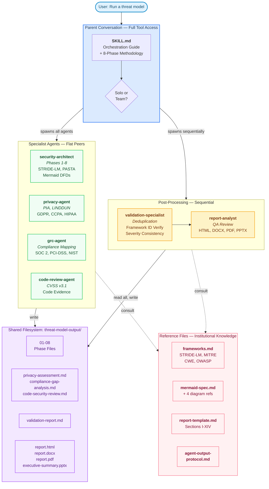
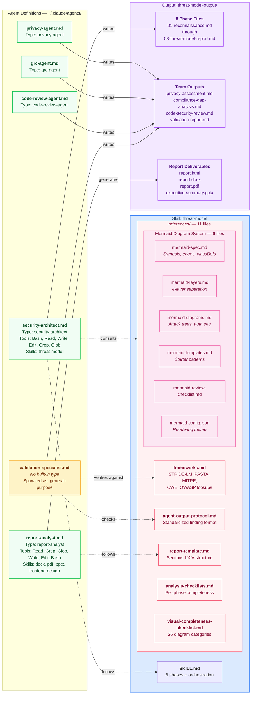
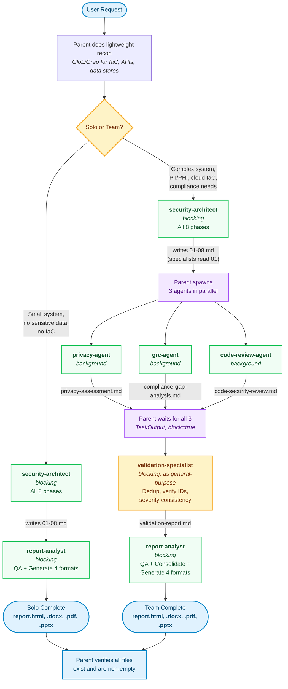

# Architecture Design Document: Claude Code Threat Modeling System

## 1. Overview

This system is a structured security assessment pipeline built entirely on Claude Code primitives: **skills**, **agents**, and **reference files**. It produces architectural threat models with data flow diagrams, multi-framework threat identification, risk quantification, and consolidated multi-format reports.

The system transforms a codebase or architecture description into a comprehensive security assessment delivered in four formats (HTML, Word, PDF, PPTX) through a pipeline of specialized AI agents, each with domain-specific expertise and standardized output contracts.

### What It Produces

| Output | Description |
|--------|-------------|
| 8 phase files (`01-reconnaissance.md` through `08-threat-model-report.md`) | Structured threat model following STRIDE-LM, PASTA, and OWASP Risk Rating methodologies |
| Mermaid data flow diagrams (L1-L4) | 4-layer architecture diagrams: structural topology, trust boundaries, data classification, risk overlay |
| `privacy-assessment.md` | LINDDUN privacy impact assessment with regulatory analysis (team mode) |
| `compliance-gap-analysis.md` | Multi-framework compliance mapping and gap analysis (team mode) |
| `code-security-review.md` | CVSS-scored code-level vulnerability findings (team mode) |
| `validation-report.md` | Cross-agent deduplication, consistency checks, framework ID verification (team mode) |
| `report.html` | Interactive web report with inline Mermaid rendering, filtering, zoom/pan |
| `report.docx` | Professional Word document with TOC, cover page, embedded diagram PNGs |
| `report.pdf` | Print-ready PDF |
| `executive-summary.pptx` | 9-11 slide executive presentation with severity charts and diagram embeds |

### What It's Good For

- **Pre-launch security reviews**: Comprehensive assessment before deploying to production
- **Architecture design reviews**: Evaluate security posture of proposed designs before implementation
- **Compliance readiness**: Map controls to SOC 2, PCI-DSS, HIPAA, ISO 27001, NIST CSF
- **Due diligence**: Structured security assessment for M&A, vendor evaluation, or audit preparation
- **Threat modeling as code**: Repeatable, version-controlled security analysis that evolves with the codebase

---

## 2. System Architecture

### Core Principle: Flat Orchestration

All agents are spawned as **flat peers by the parent conversation**. No agent spawns other agents. The parent conversation reads the skill file (SKILL.md), which contains the orchestration logic, and uses its full tool access (Task, TaskOutput, etc.) to manage the pipeline.



<details>
<summary>PNG fallback (if Mermaid doesn't render)</summary>


</details>

### Component Inventory

| Component | Type | Claude Code Primitive | Built-in Agent Type | Purpose |
|-----------|------|----------------------|--------------------|---------|
| `SKILL.md` | Skill | `~/.claude/skills/threat-model/SKILL.md` | N/A | 8-phase threat model methodology + orchestration guide |
| `security-architect` | Agent | `~/.claude/agents/security-architect.md` | `security-architect` | Executes threat model phases 1-8 |
| `privacy-agent` | Agent | `~/.claude/agents/privacy-agent.md` | `privacy-agent` | Privacy impact assessment |
| `grc-agent` | Agent | `~/.claude/agents/grc-agent.md` | `grc-agent` | Compliance gap analysis |
| `code-review-agent` | Agent | `~/.claude/agents/code-review-agent.md` | `code-review-agent` | Code-level vulnerability analysis |
| `validation-specialist` | Agent | `~/.claude/agents/validation-specialist.md` | None (spawned as `general-purpose`) | Cross-agent validation and deduplication |
| `report-analyst` | Agent | `~/.claude/agents/report-analyst.md` | `report-analyst` | QA review + 4-format report generation |
| 11 reference files | Reference | `references/*.md` + `mermaid-config.json` | N/A | Frameworks, checklists, diagram specs, report template |

### Two Execution Modes

**Solo Mode** — for small, focused systems:
```
Parent → security-architect (blocking, phases 1-8) → report-analyst (blocking)
```

**Team Mode** — for complex systems (default):
```
Parent → security-architect (blocking, phases 1-8)
       → privacy-agent + grc-agent + code-review-agent (parallel, background)
       → wait for all 3
       → validation-specialist (blocking)
       → report-analyst (blocking)
```

The mode is selected by the parent based on system characteristics discovered during lightweight reconnaissance (see SKILL.md § "Solo vs Team Decision").

---

## 3. How It Works Technically

### 3.1 Invocation

The user asks for a threat model or security assessment. The parent conversation loads the `threat-model` skill, which injects SKILL.md into the parent's context. The parent then follows the orchestration instructions.

```
User: "Run a threat model on this project"
  → Parent loads SKILL.md
  → Parent does lightweight recon (Glob/Grep for IaC, APIs, data stores)
  → Parent decides solo vs team
  → Parent spawns agents sequentially/parallel per workflow
```

### 3.2 Agent Spawning

Each agent is spawned via the `Task` tool with specific parameters:

```
Task(
  subagent_type: "security-architect",    // built-in agent type
  name: "threat-modeler",                 // display name
  prompt: "Execute all 8 phases...",      // instructions + paths
  run_in_background: false                // blocking (or true for parallel)
)
```

The agent's `.md` file (in `~/.claude/agents/`) customizes the built-in type with domain-specific instructions, personality, model selection, and skill access.

### 3.3 Inter-Agent Communication

Agents do **not** communicate with each other directly. All coordination happens through the **shared filesystem**:

```
{project_root}/threat-model-output/
├── 01-reconnaissance.md          ← security-architect writes
├── 02-structural-diagram.md      ← security-architect writes
├── ...
├── 08-threat-model-report.md     ← security-architect writes
├── privacy-assessment.md         ← privacy-agent reads 01, writes this
├── compliance-gap-analysis.md    ← grc-agent reads 01, writes this
├── code-security-review.md       ← code-review-agent reads 01, writes this
├── validation-report.md          ← validation-specialist reads all, writes this
├── consolidated-report.md        ← report-analyst reads all, writes this
├── report.html                   ← report-analyst generates
├── report.docx                   ← report-analyst generates
├── report.pdf                    ← report-analyst generates
└── executive-summary.pptx        ← report-analyst generates
```

This design is intentional — see § 4.3 for justification.

### 3.4 The Agent Output Protocol

All specialist agents follow a standardized output format defined in `references/agent-output-protocol.md`. This contract ensures downstream agents (validation-specialist, report-analyst) can reliably parse and cross-reference outputs.

Key elements:
- **Structured metadata block** (agent name, date, scope, methodology, scoring system)
- **Prefixed finding IDs** (`TM-001`, `CR-001`, `PA-001`, `GRC-001`) for cross-referencing
- **Standardized finding format** (severity, confidence, affected components, cross-framework IDs, evidence, attack scenario, recommendation)
- **Scoring system preservation** — OWASP Risk Rating (threat model), CVSS v3.1 (code review), and qualitative (GRC) are never converted between each other

### 3.5 The Reference File System

The skill carries 11 reference files that provide deterministic, verifiable foundations:

| File | Role |
|------|------|
| `frameworks.md` | Canonical STRIDE-LM, PASTA, MITRE ATT&CK, CWE, OWASP definitions and lookup tables |
| `analysis-checklists.md` | Per-phase completeness checklists |
| `mermaid-spec.md` | Symbol taxonomy, typed edges, classDefs, annotation format |
| `mermaid-layers.md` | 4-layer separation (L1 Architecture → L4 Threat Overlay) |
| `mermaid-diagrams.md` | Companion diagram types (attack trees, auth sequences) |
| `mermaid-templates.md` | Copy-paste starter templates for common architectures |
| `mermaid-review-checklist.md` | Pre-submission diagram quality gates |
| `mermaid-config.json` | Rendering configuration (fonts, spacing, curves) for consistent output |
| `visual-completeness-checklist.md` | 26-category coverage tracker for diagram completeness |
| `report-template.md` | Canonical report structure (sections I-XIV) |
| `agent-output-protocol.md` | Standardized finding format for all agents |

These files serve as the system's **institutional knowledge** — they prevent hallucination of framework IDs, enforce consistent diagram conventions, and ensure report structure is deterministic across runs.

### 3.6 Report Generation Pipeline

The report-analyst executes a 3-step pipeline:

```
Step 1: QA Pass
  Read all phase files + team outputs
  Validate: structure, finding counts, framework IDs, cross-references
  Fix critical issues inline

Step 2: Consolidation
  Deduplicate findings across agents (component + CWE matching)
  Cross-key everything (findings ↔ diagrams ↔ remediation ↔ components)
  Produce consolidated-report.md following report-template.md exactly

Step 2.5: Render Diagram PNGs
  Extract Mermaid code from phase files → .mmd files
  Pre-process (strip invalid syntax like ~~> arrows)
  Render via: npx @mermaid-js/mermaid-cli -i file.mmd -o file.png
  Verify PNGs are >100 bytes (not placeholder stubs)

Step 3: Multi-Format Generation
  HTML:  Single-file interactive report with live Mermaid rendering, zoom/pan
  DOCX:  python-docx with TOC, cover page, embedded PNGs on landscape pages
  PDF:   Convert from DOCX via LibreOffice or generate with ReportLab
  PPTX:  python-pptx executive presentation with severity charts + diagram embeds
```

---

## 4. Design Decisions and Justifications

### 4.1 Why Flat Orchestration (Not Nested Agent Spawning)

**Decision**: The parent conversation spawns all agents. No agent spawns other agents.

**Constraint discovered**: Claude Code custom agents (defined in `~/.claude/agents/`) can customize description, model, color, memory, and skills for built-in agent types, but **cannot add tools** beyond the built-in type's set. The `tools:` frontmatter field only **restricts** — it never expands.

The built-in `security-architect` type has 6 tools: Bash, Read, Write, Edit, Grep, Glob. Listing Task, TeamCreate, or SendMessage in its frontmatter was silently ignored. The agent literally could not spawn subagents.

**Additional constraint**: The `validation-specialist` has no built-in agent type counterpart. It cannot be spawned as `subagent_type: "validation-specialist"` — it must be spawned as `general-purpose` with custom instructions pointing to its `.md` file.

**Resolution**: Move all orchestration logic to SKILL.md, which runs in the parent conversation. The parent has access to all tools. Every agent becomes a focused specialist that reads inputs, does its work, and writes outputs.

**Benefit**: This architecture is actually cleaner than nested spawning. Every agent is visible to the user. There's no hidden orchestration happening inside an agent. The pipeline is transparent and debuggable.

### 4.2 Why a Skill (Not Just an Agent)

**Decision**: The threat modeling methodology lives in a skill (`SKILL.md`), not embedded in the security-architect agent.

**Justification**:
- **Separation of concerns**: The methodology (8 phases, reference files, checklists) is distinct from the agent's personality and capabilities. The skill defines *what* to do; the agent defines *who* does it.
- **Reusability**: The skill could theoretically be attached to different agents or invoked in different contexts.
- **Context injection**: Skills are loaded into the parent conversation's context, giving the parent access to the orchestration logic and reference file paths. An agent's instructions only affect that agent — they can't guide the parent.
- **Reference file co-location**: The skill carries 11 reference files in its `references/` directory. These are domain knowledge (framework definitions, diagram specs, report templates) that multiple agents need. Co-locating them with the skill keeps the knowledge graph coherent.

### 4.3 Why Filesystem-Based Communication (Not Message Passing)

**Decision**: Agents communicate through shared files in `{output_dir}/`, not through SendMessage or other IPC mechanisms.

**Justification**:
- **Tool constraints**: Most built-in agent types don't have SendMessage. Filesystem I/O (Read/Write) is universally available.
- **Auditability**: Every intermediate artifact is a readable markdown file on disk. The user can inspect, edit, or re-run any stage.
- **Idempotency**: If an agent fails, its output file is either absent (re-run) or partially written (inspect and decide). There's no hidden message queue state.
- **Context preservation**: Agents can read as much or as little of the prior outputs as they need. The validation-specialist reads everything; the privacy-agent only reads `01-reconnaissance.md`.
- **Debugging**: When something goes wrong, you can `ls` the output directory and see exactly which stages completed and what they produced.

### 4.4 Why Sequential Threat Modeling Before Parallel Specialists

**Decision**: The security-architect runs all 8 phases to completion before any specialist agents start.

**Justification**:
- **Dependency**: All specialists depend on `01-reconnaissance.md` for system context (components, data flows, technology stack, threat actors). They need the full picture before doing domain-specific analysis.
- **Phase integrity**: The 8 phases are designed as a sequential cognitive pipeline — each phase builds on the previous. Phase 3 (Threat Identification) reads Phase 2 (Structural Diagram). Phase 4 (Risk Quantification) reads Phase 3. Breaking this sequence would compromise quality.
- **Parallel specialists are independent**: Once reconnaissance is complete, privacy, compliance, and code review are genuinely independent — they analyze different aspects of the same system. Running them in parallel is safe and efficient.

### 4.5 Why a Separate Validation Step

**Decision**: A dedicated validation-specialist runs between the specialists and the report-analyst.

**Justification**:
- **Cross-agent deduplication**: The same vulnerability often appears in multiple agent outputs with different terminology (e.g., "weak password hashing" from code review = "password storage" from privacy = "CWE-327" from architecture). Without deduplication, the final report would contain redundant findings.
- **Framework ID verification**: LLMs hallucinate MITRE ATT&CK and CWE IDs. A dedicated verification step cross-references every cited ID against the canonical tables in `references/frameworks.md`.
- **Severity consistency**: Different agents may rate the same issue differently. The validation step detects and documents these conflicts so the report-analyst can resolve them.
- **Quality gate**: The validation-specialist is the "QA before QA" — it catches issues that would otherwise require the report-analyst to do detective work during consolidation.

### 4.6 Why `general-purpose` for the Validation Specialist

**Decision**: The validation-specialist is spawned as `subagent_type: "general-purpose"` rather than a custom agent type.

**Constraint**: Claude Code only allows spawning agents whose `subagent_type` matches a built-in agent type. There is no built-in `validation-specialist` type. Attempting to spawn it as its custom type silently fails.

**Resolution**: Spawn as `general-purpose` (which has access to all tools) and pass custom instructions in the prompt that point to the agent's `.md` file: "Read your full instructions from `/path/to/validation-specialist.md`".

**Trade-off**: The agent doesn't get automatic loading of its `.md` file — it must explicitly read it. But it gains access to all tools, which is more than adequate for validation work (Read, Write, Grep, Glob, Bash).

### 4.7 Why 11 Reference Files (Not Inline Instructions)

**Decision**: Domain knowledge lives in standalone reference files, not embedded in agent instructions or the skill file.

**Justification**:
- **Token efficiency**: Reference files are loaded on demand. An agent only reads the files it needs. Embedding everything in instructions would bloat every agent's context.
- **Single source of truth**: Framework definitions, diagram conventions, and report structure are defined once and referenced by all agents. Changes propagate automatically.
- **Verifiability**: Framework IDs can be checked against the reference tables. If `frameworks.md` says CWE-89 is SQL Injection, and an agent cites CWE-89 for an XSS finding, the validation-specialist can catch the misattribution.
- **Modularity**: The Mermaid diagram system is split into 5 files (spec, layers, diagrams, templates, review checklist) because each serves a different purpose at a different phase. The spec defines *what* to draw. The layers define *when* to draw it. The templates provide *starting points*. The review checklist validates *correctness*.

### 4.8 Why Four Report Formats

**Decision**: Every assessment produces HTML, DOCX, PDF, and PPTX.

**Justification**: Different stakeholders consume security reports differently:
- **Engineers** want the interactive HTML report — they can filter findings, click through cross-references, and zoom into diagrams.
- **Security teams** want the Word document — they can edit it, add annotations, and include it in their own documentation.
- **Executives** want the PPTX — a 10-slide deck they can present in a meeting.
- **Compliance/audit** wants the PDF — an immutable, distributable record.

Generating all four from the same consolidated source ensures consistency across formats.

---

## 5. File Layout and Component Relationships



<details>
<summary>PNG fallback (if Mermaid doesn't render)</summary>


</details>

### Directory Tree

```
~/.claude/
├── agents/
│   ├── security-architect.md        # Threat model specialist (6 tools)
│   ├── report-analyst.md            # QA + 4-format report generation
│   ├── code-review-agent.md         # Code-level vulnerability analysis
│   ├── privacy-agent.md             # Privacy impact assessment
│   ├── grc-agent.md                 # Governance, risk & compliance
│   ├── validation-specialist.md     # Cross-agent validation (spawned as general-purpose)
│   └── security-reviewer.md         # Standalone code security review
│
└── skills/
    └── threat-model/
        ├── SKILL.md                 # Methodology (8 phases) + orchestration guide
        └── references/
            ├── frameworks.md            # STRIDE-LM, PASTA, MITRE, CWE, OWASP definitions
            ├── analysis-checklists.md   # Per-phase completeness checklists
            ├── agent-output-protocol.md # Standardized finding format for all agents
            ├── report-template.md       # Canonical report structure (sections I-XIV)
            ├── mermaid-spec.md          # Symbol taxonomy, edges, classDefs, annotations
            ├── mermaid-layers.md        # 4-layer diagram separation rules
            ├── mermaid-diagrams.md      # Companion diagram types (attack trees, sequences)
            ├── mermaid-templates.md     # Starter templates for common architectures
            ├── mermaid-review-checklist.md  # Diagram quality gates
            ├── mermaid-config.json      # Rendering config (fonts, spacing, curves)
            └── visual-completeness-checklist.md  # 26-category diagram coverage tracker
```

---

## 6. Data Flow

### Both Paths (Solo + Team)



<details>
<summary>PNG fallback (if Mermaid doesn't render)</summary>


</details>

---

## 7. Scaling Model

The system adapts analysis depth to system complexity:

| System Size | Components | Diagram Strategy | Phase Adjustments |
|-------------|-----------|-----------------|-------------------|
| Small | ≤5 | 2-layer (L1+L4) | Lightweight recon, 1-2 kill chains, combined report sections |
| Medium | 6-20 | Full 4-layer (L1-L4) | Standard depth, group STRIDE-LM by trust zone |
| Large | >20 | 4-layer + sub-diagrams | Per-zone diagrams, batched threat identification, 5+ kill chains |

The scaling rules are defined in SKILL.md § "Scaling Guidelines" and enforced through the Mermaid layer strategy in `references/mermaid-layers.md`.

---

## 8. Constraints and Limitations

### Claude Code Platform Constraints

| Constraint | Impact | Mitigation |
|-----------|--------|------------|
| Custom agents cannot add tools beyond built-in set | No nested agent spawning | Flat orchestration in SKILL.md |
| Custom-only agents (no built-in type) can't be spawned by name | validation-specialist requires workaround | Spawn as `general-purpose` with custom prompt |
| `tools:` frontmatter only restricts, never expands | Listed tools silently ignored if not in built-in set | Only list tools that exist in the built-in type |
| Agent context windows are independent | Each agent starts fresh — no shared memory | Filesystem-based communication via output files |
| Mermaid rendering requires Node.js | `npx @mermaid-js/mermaid-cli` must be available | Documented as prerequisite |
| macOS managed Python (PEP 668) | `pip install` fails outside venv | All Python usage wrapped in `python3 -m venv` |

### Methodology Limitations

- **Framework ID accuracy**: Despite reference table verification, IDs are only as accurate as the reference file. The `frameworks.md` file covers common IDs but is not exhaustive.
- **Scoring system incompatibility**: OWASP Risk Rating (1-25), CVSS v3.1 (0-10), and qualitative scales cannot be meaningfully compared. The system preserves original scores rather than converting.
- **Diagram complexity ceiling**: Mermaid flowcharts become unreadable beyond ~30-40 nodes. Large systems require sub-diagrams, which add complexity to cross-referencing.
- **Single-pass analysis**: Each agent analyzes independently. There is no iterative refinement loop where findings from one agent inform another's analysis (except through the validation step).

---

## 9. Security Considerations

This system analyzes security — it should also be secure in its operation:

- **No secrets in outputs**: Agents are instructed to never include actual credentials, API keys, or secrets in findings — only references to their locations.
- **Local execution**: All processing happens locally through Claude Code. No data is sent to external services beyond the Claude API itself.
- **File-scoped outputs**: All outputs go to a single `{output_dir}/` directory that the user controls. No files are written elsewhere.
- **No network access by agents**: Agents interact only with the local filesystem (Read, Write, Grep, Glob, Bash). They do not make HTTP requests or access external services.

---

## 10. Evolution History

| Version | Change | Motivation |
|---------|--------|------------|
| v1 | Monolithic security-architect with embedded team orchestration | Initial design — agent does everything |
| v2 | Added validation-specialist, agent-output-protocol, reference files | Quality problems: duplicate findings, hallucinated IDs, inconsistent severity |
| v3 | Split Mermaid conventions into 5 modular files | Single file was too large and mixed concerns (what vs when vs how) |
| v4 | **Flat orchestration restructure** — moved team coordination from agent to SKILL.md | Discovered custom agents cannot add tools beyond built-in set. Entire team orchestration was silently broken. |

The current architecture (v4) is the result of discovering that the original design was structurally impossible within Claude Code's agent system. The flat orchestration model is not just a workaround — it is a genuinely better architecture that provides transparency, debuggability, and correct tool access.
