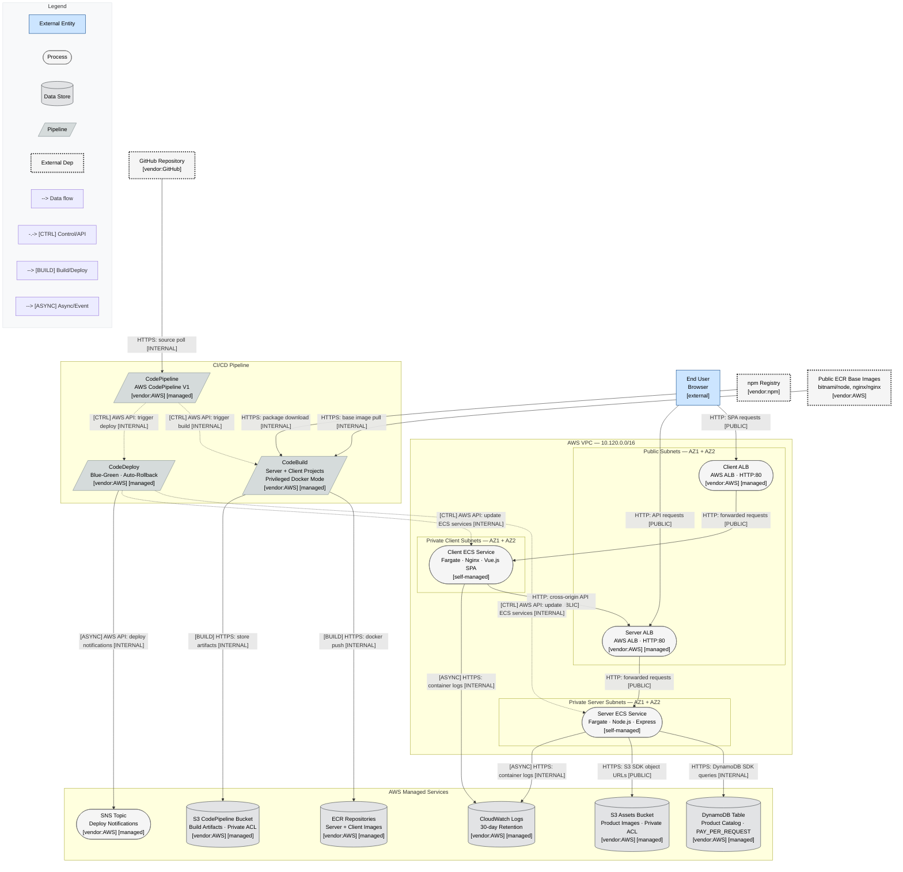
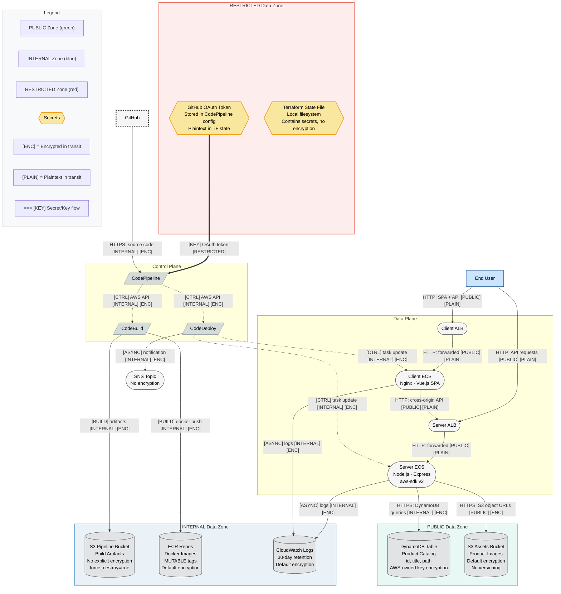

# Phase 2 -- Structural Diagram

## Metadata
| Field | Value |
|-------|-------|
| Agent | diagram-specialist |
| Date | 2026-02-18 |
| Target System | Amazon ECS Fullstack App (Terraform Demo) |
| Layer Strategy | Full 4-layer (L1, L2, L3) -- 18 components qualifies as Medium (6-20) |
| Diagram Direction | TD (top-down) -- hierarchical architecture with clear user-to-data flow |

## Design Decisions

1. **Consolidation for density compliance**: CodeBuild Server and Client are consolidated into a single node (`CodeBuild`) since they share identical IAM roles, build patterns, and security properties. Similarly, CodeDeploy Server and Client are consolidated (`CodeDeploy`), and ECR Server and Client repos are consolidated (`ECR`). This reduces the node count from ~28 to ~22, keeping diagrams readable while preserving all security-relevant information. The structural distinction (server vs client) is noted in labels.
2. **ECS Cluster omitted as a separate node**: The ECS Cluster is the container orchestration context, but for data flow purposes the relevant nodes are the Client ECS Service and Server ECS Service. The cluster context is represented by the private subnet subgraphs.
3. **VPC and Networking represented as subgraph boundaries**: The VPC, subnets, and networking components are trust boundaries rather than data flow participants. They appear as subgraphs, not process nodes.
4. **External dependencies**: npm Registry and Public ECR base images are included as external dependencies since they are supply chain attack surfaces identified in reconnaissance.
5. **Control plane vs data plane**: CI/CD pipeline is clearly separated as control plane with `[BUILD]` and `[CTRL]` typed edges. User traffic is data plane with standard data flow edges.

## Node ID Reference

All layers use consistent node IDs for cross-referencing:

| Node ID | Component | Type |
|---------|-----------|------|
| `User` | End User | External Entity |
| `GitHub` | GitHub Repository | External Entity |
| `npmReg` | npm Registry | External Dependency |
| `pubECR` | Public ECR Base Images | External Dependency |
| `ClientALB` | Client ALB | Process (Load Balancer) |
| `ServerALB` | Server ALB | Process (Load Balancer) |
| `ClientECS` | Client ECS Service | Process (Fargate + Nginx) |
| `ServerECS` | Server ECS Service | Process (Fargate + Node.js) |
| `DynamoDB` | DynamoDB Table | Data Store |
| `S3Assets` | S3 Assets Bucket | Data Store |
| `S3Pipeline` | S3 CodePipeline Bucket | Data Store |
| `ECR` | ECR Repositories (Server + Client) | Data Store / Registry |
| `CodePipeline` | AWS CodePipeline | Pipeline |
| `CodeBuild` | AWS CodeBuild (Server + Client) | Pipeline |
| `CodeDeploy` | AWS CodeDeploy (Server + Client) | Pipeline |
| `SNS` | SNS Deployment Topic | Process |
| `CloudWatch` | CloudWatch Log Groups | Data Store |
| `ECSExecRole` | ECS Task Execution Role | Identity |
| `ECSTaskRole` | ECS Task Role | Identity |
| `DevOpsRole` | DevOps IAM Role | Identity |
| `CodeDeployRole` | CodeDeploy IAM Role | Identity |
| `GitHubToken` | GitHub OAuth Token | Secrets |
| `TFState` | Terraform State File | Secrets |
| `SG_ALB` | Security Groups (ALBs) | Control |
| `SG_ECS` | Security Groups (ECS Tasks) | Control |
| `Autoscaling` | ECS Autoscaling | Control |

---

## L1: Architecture

Filename: `ecs-fullstack-L1-architecture.mmd`

---

## L2: Trust and Identity

Filename: `ecs-fullstack-L2-trust-identity.mmd`

```mermaid
flowchart TD
    %% Version: 2026-02-18 | Phase: 2 | System: ECS Fullstack App | Layer: L2

    User["End User\nUnauthenticated"]:::external
    GitHub["GitHub\n[vendor:GitHub]"]:::externalDep
    npmReg["npm Registry"]:::externalDep
    pubECR["Public ECR"]:::externalDep

    subgraph InternetBoundary["Internet — Untrusted"]
        style InternetBoundary stroke:#e74c3c,stroke-width:2px,stroke-dasharray: 5 5
    end

    subgraph VPC["VPC Boundary — 10.120.0.0/16"]
        style VPC stroke:#f39c12,stroke-width:2px,stroke-dasharray: 5 5

        subgraph PubSubnets["Public Subnets — Low Trust"]
            style PubSubnets stroke:#e74c3c,stroke-width:1px,stroke-dasharray: 5 5
            ClientALB(["Client ALB\nHTTP:80 · No TLS"]):::neutral
            ServerALB(["Server ALB\nHTTP:80 · No TLS"]):::neutral
            SG_ALB[["Security Groups\nIngress: 0.0.0.0/0:80\n[control-owner:DevOps]"]]:::control
        end

        subgraph PrivClientSubnets["Private Client Subnets — Medium Trust"]
            style PrivClientSubnets stroke:#f39c12,stroke-width:1px,stroke-dasharray: 5 5
            ClientECS(["Client ECS\nFargate · No Auth"]):::neutral
            SG_ECS_Client[["SG: ECS Client\nIngress: Client ALB SG only\n[control-owner:DevOps]"]]:::control
        end

        subgraph PrivServerSubnets["Private Server Subnets — Medium Trust"]
            style PrivServerSubnets stroke:#f39c12,stroke-width:1px,stroke-dasharray: 5 5
            ServerECS(["Server ECS\nFargate · No Auth · CORS *"]):::neutral
            SG_ECS_Server[["SG: ECS Server\nIngress: Server ALB SG only\n[control-owner:DevOps]"]]:::control
        end
    end

    subgraph AWSManaged["AWS Managed Services — High Trust"]
        style AWSManaged stroke:#27ae60,stroke-width:2px,stroke-dasharray: 5 5
        DynamoDB[("DynamoDB")]:::dataStore
        S3Assets[("S3 Assets")]:::dataStore
        S3Pipeline[("S3 Pipeline Artifacts")]:::dataStore
        ECR[("ECR Repos")]:::dataStore
        CloudWatch[("CloudWatch")]:::dataStore
        SNS(["SNS"]):::neutral
    end

    subgraph CICDBoundary["CI/CD Pipeline — Elevated Trust"]
        style CICDBoundary stroke:#8e44ad,stroke-width:2px,stroke-dasharray: 5 5
        CodePipeline[/"CodePipeline"/]:::pipeline
        CodeBuild[/"CodeBuild\nPrivileged Docker"/]:::pipeline
        CodeDeploy[/"CodeDeploy\nBlue-Green"/]:::pipeline
    end

    subgraph IAMIdentities["IAM Principals"]
        ECSExecRole{"ECS Execution Role\nECR pull, CW Logs"}:::identity
        ECSTaskRole{"ECS Task Role\nDynamoDB, S3 access"}:::identity
        DevOpsRole{"DevOps Role\nPassRole *, ECR, S3, ECS\nCodeBuild, CodeDeploy"}:::identity
        CodeDeployRole{"CodeDeploy Role\nECS, ALB, S3, SNS"}:::identity
    end

    Autoscaling[["Autoscaling\nCPU/Memory 50%\nMin:1 Max:4\n[control-owner:DevOps]"]]:::control

    %% Data plane (no auth)
    User -->|"HTTP: requests [PUBLIC]"| ClientALB
    User -->|"HTTP: requests [PUBLIC]"| ServerALB
    ClientALB -->|"HTTP: forwarded [PUBLIC]"| ClientECS
    ServerALB -->|"HTTP: forwarded [PUBLIC]"| ServerECS
    ClientECS -->|"HTTP: cross-origin API [PUBLIC]"| ServerALB
    ServerECS -->|"HTTPS: queries [INTERNAL]"| DynamoDB
    ServerECS -->|"HTTPS: object URLs [PUBLIC]"| S3Assets

    %% IAM role assumptions
    ECSExecRole -.->|"[CTRL] IAM: AssumeRole [RESTRICTED]"| ClientECS
    ECSExecRole -.->|"[CTRL] IAM: AssumeRole [RESTRICTED]"| ServerECS
    ECSTaskRole -.->|"[CTRL] IAM: AssumeRole [RESTRICTED]"| ServerECS
    DevOpsRole -.->|"[CTRL] IAM: AssumeRole [RESTRICTED]"| CodeBuild
    DevOpsRole -.->|"[CTRL] IAM: AssumeRole [RESTRICTED]"| CodePipeline
    CodeDeployRole -.->|"[CTRL] IAM: AssumeRole [RESTRICTED]"| CodeDeploy

    %% CI/CD control plane
    GitHub -->|"HTTPS: source poll [INTERNAL]"| CodePipeline
    CodePipeline -.->|"[CTRL] trigger build [INTERNAL]"| CodeBuild
    CodeBuild -->|"[BUILD] docker push [INTERNAL]"| ECR
    CodePipeline -.->|"[CTRL] trigger deploy [INTERNAL]"| CodeDeploy
    CodeDeploy -.->|"[CTRL] update ECS [INTERNAL]"| ServerECS
    CodeDeploy -.->|"[CTRL] update ECS [INTERNAL]"| ClientECS

    %% Security control enforcement
    SG_ALB -.->|"[CTRL] ingress filter"| ClientALB
    SG_ALB -.->|"[CTRL] ingress filter"| ServerALB
    SG_ECS_Client -.->|"[CTRL] ingress filter"| ClientECS
    SG_ECS_Server -.->|"[CTRL] ingress filter"| ServerECS
    Autoscaling -.->|"[CTRL] scaling policy"| ClientECS
    Autoscaling -.->|"[CTRL] scaling policy"| ServerECS

    %% Logging
    ServerECS -->|"[ASYNC] logs [INTERNAL]"| CloudWatch
    ClientECS -->|"[ASYNC] logs [INTERNAL]"| CloudWatch
    CodeBuild -->|"[ASYNC] build logs [INTERNAL]"| CloudWatch

    %% Supply chain
    npmReg -->|"HTTPS: packages [INTERNAL]"| CodeBuild
    pubECR -->|"HTTPS: base images [INTERNAL]"| CodeBuild

    %% Notifications
    CodeDeploy -->|"[ASYNC] notifications [INTERNAL]"| SNS

    subgraph Legend["Legend"]
        style Legend fill:#f8f9fa,stroke:#dee2e6
        L_Ext["External Entity"]:::external
        L_Proc(["Process"]):::neutral
        L_DS[("Data Store")]:::dataStore
        L_IAM{"IAM Role"}:::identity
        L_Ctrl[["Security Control"]]:::control
        L_Pipe[/"Pipeline"/]:::pipeline
        L_EDep["External Dep"]:::externalDep
        L_TB["--- = Trust Boundary"]
        L_DF["-->  Data flow"]
        L_CTRL["-.-> [CTRL] Control/API"]
        L_BUILD["-->  [BUILD] Build/Deploy"]
        L_ASYNC["-->  [ASYNC] Async"]
    end

    classDef neutral fill:#f5f5f5,stroke:#666,stroke-width:1px,color:#000
    classDef external fill:#cce5ff,stroke:#004085,stroke-width:1px,color:#000
    classDef dataStore fill:#e2e3e5,stroke:#383d41,stroke-width:1px,color:#000
    classDef identity fill:#d4e6f1,stroke:#2980b9,stroke-width:1px,color:#000
    classDef secrets fill:#f9e79f,stroke:#f39c12,stroke-width:2px,color:#000
    classDef control fill:#abebc6,stroke:#27ae60,stroke-width:1px,color:#000
    classDef pipeline fill:#d5dbdb,stroke:#7f8c8d,stroke-width:1px,color:#000
    classDef externalDep fill:#f5f5f5,stroke:#333,stroke-width:3px,stroke-dasharray:3,color:#000
```

---

## L3: Data

Filename: `ecs-fullstack-L3-data.mmd`

---

## Visual Completeness Coverage

Coverage of applicable categories in structural diagrams (L1 + L2 + L3):

| # | Category | Covered? | Diagram(s) | Evidence |
|---|----------|----------|------------|----------|
| 1 | External Entities | YES | L1, L2, L3 | User, GitHub, npm Registry, Public ECR as `:::external` / `:::externalDep` |
| 2 | Processes | YES | L1, L2, L3 | ClientALB, ServerALB, ClientECS, ServerECS, SNS as `([...])` stadiums |
| 3 | Data Stores | YES | L1, L2, L3 | DynamoDB, S3Assets, S3Pipeline, ECR, CloudWatch as `[(...)]` cylinders |
| 4 | Trust Boundaries | YES | L2 | Internet, VPC, Public Subnets, Private Client/Server Subnets, AWS Managed, CI/CD as dashed subgraphs |
| 5 | Data Flow Labels | YES | L1, L2, L3 | Every edge labeled with protocol, data type, sensitivity |
| 8 | Component Metadata | YES | L1, L2 | Tech stack, security features, managed/self-managed in node labels |
| 9 | Identity Elements | YES | L2 | ECSExecRole, ECSTaskRole, DevOpsRole, CodeDeployRole as `{...}:::identity` diamonds |
| 10 | Secrets/Key Mgmt | YES | L3 | GitHubToken, TFState as `{{...}}:::secrets` hexagons in RESTRICTED zone |
| 11 | Control/Data Plane | YES | L1, L2 | CI/CD edges use `[CTRL]` and `[BUILD]` prefixes; user traffic uses default data flow |
| 13 | Control Indicators | YES | L2 | SG_ALB, SG_ECS_Client, SG_ECS_Server, Autoscaling as `[[...]]:::control` subroutines |
| 14 | Data Classification | YES | L3 | PUBLIC, INTERNAL, RESTRICTED zones as colored subgraphs |
| 15 | Encryption State | YES | L3 | Every edge labeled with `[ENC]` or `[PLAIN]` |
| 16 | Network Zones | YES | L1, L2 | VPC 10.120.0.0/16, Public Subnets, Private Client/Server Subnets as subgraphs with CIDR |
| 17 | Deployment Pipeline | YES | L1, L2, L3 | CodePipeline, CodeBuild, CodeDeploy as `[/...../]:::pipeline` parallelograms |
| 18 | External Dependencies | YES | L1, L2 | GitHub, npm Registry, Public ECR as `:::externalDep` |
| 21 | Typed Edges | YES | L1, L2, L3 | Data flow, [CTRL], [BUILD], [ASYNC], [KEY] edge types used |
| 22 | Ownership Markers | YES | L1 | `[vendor:AWS]`, `[vendor:GitHub]`, `[vendor:npm]`, `[self-managed]`, `[managed]` in labels |
| 24 | Version Stamp | YES | L1, L2, L3 | `%% Version:` comment at top of each diagram |
| 25 | Density Compliance | YES | All | L1: ~22 nodes in 4 subgraphs; L2: ~24 nodes in 6 subgraphs; L3: ~18 nodes in 5 subgraphs. No subgraph exceeds 15 nodes. |

**Categories deferred to Phase 7 (risk overlay)**:
- 6: Risk Color Coding
- 7: Threat Annotations
- 12: Attack Paths
- 23: Machine-Parseable Annotations

**Categories not applicable**:
- 19: Tenant Boundaries (single-tenant demo)
- 20: Region Boundaries (single-region deployment)

**Category 26 (Companion Diagrams)**: Attack trees will be produced in Phase 5; auth sequence (documenting the absence of auth) will be produced in Phase 3.

---

## Execution Log

### Process Health
| Metric | Value |
|--------|-------|
| Phase | 2 (Structural Diagram) |
| Files Read | 9 (01-reconnaissance.md, visual-completeness-checklist.md, mermaid-spec.md, mermaid-layers.md, mermaid-diagrams.md, mermaid-templates.md, mermaid-review-checklist.md, mermaid-config.json, diagram-specialist.md) |
| Files Written | 1 (02-structural-diagram.md) |
| Diagrams Produced | 3 (L1, L2, L3) |
| Errors Encountered | 0 |
| Self-Assessed Output Quality | HIGH |

### Diagram Complexity
| Diagram | Nodes | Edges | Subgraphs |
|---------|-------|-------|-----------|
| L1 Architecture | 22 | 21 | 5 (VPC, PubSubnets, PrivClient, PrivServer, AWSManaged, CICDPipeline, Legend) |
| L2 Trust and Identity | 26 | 32 | 8 (Internet, VPC, PubSubnets, PrivClient, PrivServer, AWSManaged, CICD, IAMIdentities, Legend) |
| L3 Data | 18 | 19 | 6 (PublicZone, InternalZone, RestrictedZone, DataPlane, ControlPlane, Legend) |

### Mermaid Syntax Issues
- None encountered. All diagrams use valid flowchart TD syntax with supported shapes, edge types, and classDef declarations.
- Avoided `note` blocks (invalid in flowchart mode per mermaid-spec.md section 9).
- Avoided `~~>` wavy arrows (invalid Mermaid syntax).
- All special characters in labels wrapped in double quotes where needed.

### Visual Completeness
- **Categories covered**: 19/24 applicable categories represented in structural diagrams
- **Categories deferred to Phase 7**: 4 (Risk Color Coding, Threat Annotations, Attack Paths, Machine-Parseable Annotations) -- these are risk-overlay-only categories
- **Categories deferred to companion diagrams**: 1 (Companion Diagrams -- Phase 3 auth sequence, Phase 5 attack trees)
- **Categories not applicable**: 2 (Tenant Boundaries, Region Boundaries)

### Design Tradeoffs
1. **Node consolidation**: Combined CodeBuild Server+Client, CodeDeploy Server+Client, and ECR Server+Client repos into single nodes to stay within density limits. This trades per-component granularity for diagram readability. The security properties of the paired components are identical, so no security-relevant information is lost.
2. **ECS Cluster omission**: The ECS Cluster is an organizational resource, not a distinct data flow participant. Its security context (container insights disabled) is documented in reconnaissance and will be referenced in threat identification.
3. **NAT Gateway omission as a node**: The NAT Gateway is a network infrastructure component. Its security relevance (single AZ, traffic to AWS services via internet) is captured in the VPC subgraph context and will be addressed in threat identification.
4. **L2 density**: The L2 diagram is the densest at 26 nodes across 8 subgraphs. This is at the upper bound of the 25-node guideline. Given that splitting would fragment the trust relationship view, the single diagram was retained. All subgraphs remain under 15 nodes.

### Assumptions
1. The `InternetBoundary` subgraph in L2 is empty because external entities (User, GitHub) are outside all boundaries. The boundary is shown for completeness to mark the trust transition.
2. The Server ECS service's cross-origin API call from Client ECS is shown as routing through the Server ALB, matching the actual network path (the Vue.js SPA makes HTTP requests to the Server ALB's public URL).
3. AWS SDK calls from Server ECS to DynamoDB and S3 are shown as HTTPS [ENC] because the AWS SDK uses HTTPS by default, even though these calls transit the NAT Gateway to reach public AWS endpoints.
