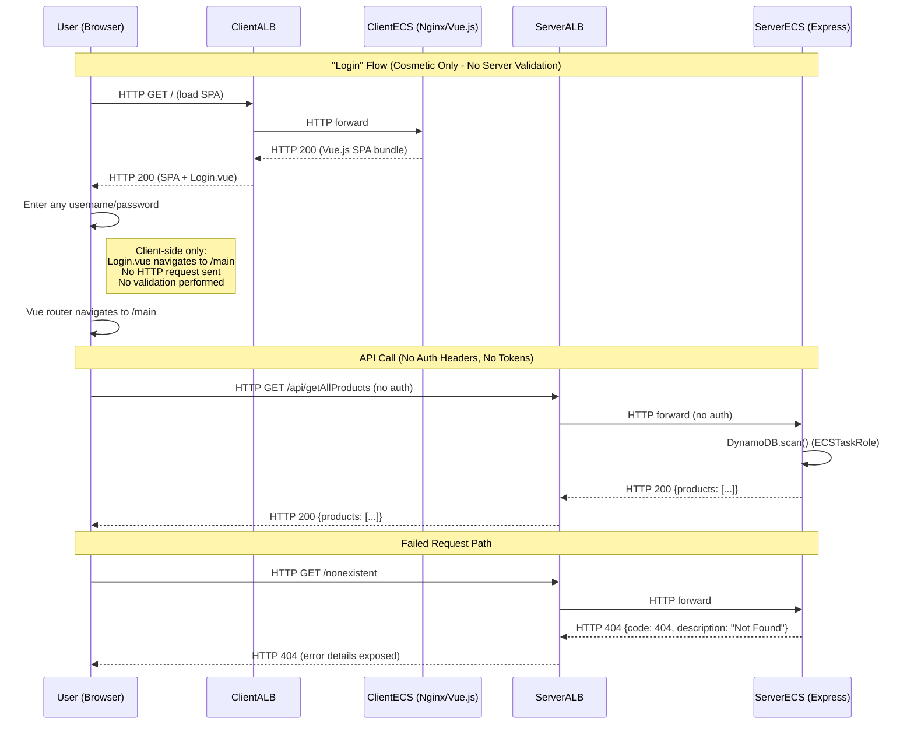

# Security Architect -- Phase 3 Threat Identification

## Metadata
| Field | Value |
|-------|-------|
| Agent | security-architect |
| Date | 2026-02-18 |
| Target System | Amazon ECS Fullstack App (Terraform Demo) |
| Scope | All 18 components, all data flows, all trust boundaries identified in Phase 1 |
| Methodology | STRIDE-LM + MITRE ATT&CK + OWASP Top 10 + CWE mapping |
| Scoring System | OWASP Risk Rating (scoring deferred to Phase 4) |

## Approach

Threats are identified by trust zone, then cross-zone. For each STRIDE-LM category, the assessment covers all affected components and data flows using component names from the Phase 2 structural diagram. No likelihood, impact, or severity scores are assigned in this phase.

---

## STRIDE-LM Assessment by Trust Zone

### Internet / Public Boundary (User --> ClientALB, User --> ServerALB)

**Spoofing**: No authentication exists anywhere. Any internet user can impersonate any other user because there are no user identities to distinguish. More critically, the Vue.js login component creates a false sense of security -- it accepts any credentials and navigates to `/main` without server-side validation.

**Tampering**: HTTP-only traffic (no TLS) means any network-position attacker can modify requests and responses in transit between User and ClientALB or ServerALB. Request bodies, API responses, and the SPA bundle itself can all be altered.

**Repudiation**: With no authentication, no session management, and no request logging at the application layer, there is no way to attribute any action to a specific user. CloudWatch captures container stdout but not structured access logs with client IP attribution.

**Information Disclosure**: All data transmitted between users and ALBs is plaintext HTTP. Product catalog data, S3 asset URLs, error messages, and the Swagger API documentation are all exposed without encryption.

**Denial of Service**: Both ALBs accept traffic from 0.0.0.0/0 on port 80 with no WAF, no rate limiting, and no bot detection. Autoscaling max is 4 tasks, which is trivially overwhelmed.

**Elevation of Privilege**: With no authorization controls, all users already have full access to all endpoints. There is no privilege boundary to escalate past, which is itself the vulnerability.

**Lateral Movement**: From the public ALBs, an attacker can reach the Swagger documentation at `/api/docs` which reveals the entire API surface. The ServerALB provides a direct path to ServerECS, which has IAM credentials for DynamoDB and S3.

### VPC Data Plane (ClientALB --> ClientECS, ServerALB --> ServerECS, ClientECS --> ServerALB)

**Spoofing**: No service-to-service authentication between ALBs and ECS tasks. Traffic is filtered by security groups (source SG matching) but not authenticated. The ClientECS --> ServerALB path uses the public ALB URL (crosses trust boundary unnecessarily).

**Tampering**: HTTP between ALBs and tasks means traffic within the VPC is also unencrypted. While the private subnets limit exposure, any compromised component in the VPC could modify inter-service traffic.

**Information Disclosure**: The SERVER_ALB_URL is embedded at build time into the client SPA (`RestServices.js`), exposing the backend ALB's public DNS in client-side JavaScript visible to all users.

### AWS Managed Services (ServerECS --> DynamoDB, ServerECS --> S3Assets)

**Spoofing**: AWS SDK calls use IAM role credentials (ECSTaskRole) which are short-lived and rotated by the ECS agent. This is well-designed. However, the ECSTaskRole has `iam:PassRole` on resource `*`, which means any code running in the server container could pass any IAM role to any AWS service.

**Tampering**: DynamoDB data integrity relies entirely on IAM permissions. The ECSTaskRole only has read permissions (Scan, Query, GetItem) for DynamoDB, which is appropriate. No write access to product data from the application.

**Information Disclosure**: AWS SDK calls go over HTTPS (encrypted in transit). Data at rest uses AWS-owned encryption keys (no customer-managed KMS). This means AWS has the encryption keys -- acceptable for public product data but worth noting.

**Elevation of Privilege**: The `iam:PassRole` on `*` in ECSTaskRole is a privilege escalation vector. If an attacker achieves code execution in ServerECS, they could use PassRole to assume or delegate any role in the account.

### CI/CD Pipeline (GitHub --> CodePipeline --> CodeBuild --> ECR, CodeDeploy --> ECS)

**Spoofing**: GitHub v1 source action uses a long-lived OAuth token. If this token is compromised, an attacker can impersonate the legitimate repository and inject malicious code. The token is stored in plaintext in Terraform state.

**Tampering**: The buildspec is sourced from the repository (`buildspec_path` variable). Any developer with push access to the repository can modify the buildspec to execute arbitrary commands during the build phase with the DevOps IAM role's permissions. This is the most critical code integrity threat.

**Repudiation**: CodeBuild logs go to CloudWatch, providing build-time auditing. However, there are no pipeline approval gates, no build artifact signing, and no deployment audit trail beyond CloudWatch logs.

**Information Disclosure**: CodeBuild environment variables include AWS_ACCOUNT_ID, ECR repo URLs, DynamoDB table names, IAM role names, and the server ALB URL. These are logged and visible in the CodeBuild console. Not secrets per se, but they reduce the attacker's reconnaissance effort.

**Denial of Service**: A malicious commit could introduce a build that intentionally deploys broken code. Blue/Green deployment with auto-rollback on DEPLOYMENT_FAILURE mitigates this partially.

**Elevation of Privilege**: The DevOps IAM role has `iam:PassRole` on `*`, S3 access on `*`, ECS access on `*`, and can register task definitions. Combined with repository-sourced buildspec, this means any developer can escalate to near-admin AWS access through the pipeline.

**Lateral Movement**: CodeBuild runs in privileged Docker mode (`privileged_mode = true`). From CodeBuild, the DevOps role can access any S3 bucket in the account, any ECS service, and pass any IAM role. This is a pivot point from code repository access to full AWS account access.

### Terraform State and Secrets (TFState, GitHubToken)

**Information Disclosure**: Terraform state is stored locally with no encryption and no remote backend. The state file contains the GitHub OAuth token in plaintext, all resource ARNs, and all configuration details. Anyone with filesystem access to the deployer's workstation has full visibility into the infrastructure.

**Tampering**: Local Terraform state can be modified to cause infrastructure drift, resource replacement, or introduction of malicious configurations on the next `terraform apply`.

### Supply Chain (npmReg --> CodeBuild, pubECR --> CodeBuild)

**Tampering**: Dockerfiles use `npm install` instead of `npm ci`, which does not enforce lockfile integrity. Base images use `latest` tag from public ECR, which can change at any time. ECR repositories have `image_tag_mutability = "MUTABLE"`, allowing post-push tag overwrite.

---

## Identified Threats

### TM-001: No TLS/HTTPS on Public-Facing Load Balancers

| Field | Content |
|-------|---------|
| **Threat ID** | TM-001 |
| **Title** | No TLS/HTTPS on Public-Facing Load Balancers |
| **STRIDE-LM category** | I, T |
| **Affected component(s)** | ClientALB, ServerALB |
| **Affected data flow(s)** | User --> ClientALB, User --> ServerALB, ClientALB --> ClientECS, ServerALB --> ServerECS, ClientECS --> ServerALB |
| **Cross-framework** | MITRE: T1557 Adversary-in-the-Middle (not in reference set -- manual verification recommended) | CWE-311 | OWASP A02:2021 | CIA: C-H, I-M |
| **Description** | Both ALBs listen on HTTP port 80 only. The HTTPS listener exists in the Terraform code but `enable_https` defaults to false. All user traffic -- including API responses, SPA content, and any future sensitive data -- traverses the internet in plaintext. This enables trivial traffic interception and modification by any network-position attacker. |

### TM-002: Complete Absence of Authentication and Authorization

| Field | Content |
|-------|---------|
| **Threat ID** | TM-002 |
| **Title** | Complete Absence of Authentication and Authorization |
| **STRIDE-LM category** | S, E |
| **Affected component(s)** | ServerALB, ServerECS, ClientALB, ClientECS |
| **Affected data flow(s)** | User --> ServerALB (all API routes), User --> ClientALB |
| **Cross-framework** | MITRE: T1190 | CWE-306 | OWASP A07:2021, API2:2023 | CIA: C-M, I-M, A-L |
| **Description** | No authentication or authorization exists anywhere in the stack. The Login.vue component is purely cosmetic -- it accepts any input and navigates client-side. All API endpoints (`/status`, `/api/getAllProducts`, `/api/docs`) are publicly accessible without credentials. Any internet user has the same access level as any other. |

### TM-003: Overly Broad IAM PassRole Permissions

| Field | Content |
|-------|---------|
| **Threat ID** | TM-003 |
| **Title** | Overly Broad IAM PassRole Permissions |
| **STRIDE-LM category** | E, LM |
| **Affected component(s)** | DevOpsRole, ECSTaskRole, CodeBuild, ServerECS |
| **Affected data flow(s)** | DevOpsRole --> CodeBuild, ECSTaskRole --> ServerECS |
| **Cross-framework** | MITRE: T1078 | CWE-269 | OWASP A01:2021 | CIA: C-H, I-H, A-H |
| **Description** | Both the DevOps IAM role and the ECS task role have `iam:PassRole` with resource `*`. This means any process using either role can pass any IAM role in the AWS account to any AWS service. An attacker with code execution in CodeBuild or ServerECS could escalate to any role, including roles with admin-level permissions. This is the single highest-privilege misconfiguration in the infrastructure. |

### TM-004: Repository-Sourced Buildspec with Broad IAM Permissions

| Field | Content |
|-------|---------|
| **Threat ID** | TM-004 |
| **Title** | Repository-Sourced Buildspec with Broad IAM Permissions |
| **STRIDE-LM category** | T, E, LM |
| **Affected component(s)** | CodeBuild, CodePipeline, DevOpsRole |
| **Affected data flow(s)** | GitHub --> CodePipeline --> CodeBuild |
| **Cross-framework** | MITRE: T1195 | CWE-269 | OWASP A08:2021 | CIA: C-H, I-H, A-H |
| **Description** | CodeBuild sources its buildspec from the repository. Any developer with push access can modify `buildspec.yml` to execute arbitrary commands that run with the DevOps IAM role's permissions. The DevOps role has PassRole on *, S3 access on *, ECS management on *, and ECR push access. There are no pipeline approval gates, no buildspec hash verification, and no branch protection. This is effectively a backdoor from GitHub repository access to full AWS infrastructure control. |

### TM-005: GitHub OAuth Token Exposure in Terraform State

| Field | Content |
|-------|---------|
| **Threat ID** | TM-005 |
| **Title** | GitHub OAuth Token Exposure in Terraform State |
| **STRIDE-LM category** | I, S |
| **Affected component(s)** | TFState, GitHubToken, CodePipeline |
| **Affected data flow(s)** | GitHubToken --> CodePipeline |
| **Cross-framework** | MITRE: T1552 | CWE-312 | OWASP A02:2021 | CIA: C-H |
| **Description** | The GitHub OAuth token is passed as a Terraform variable and stored in plaintext in the local Terraform state file. The state file has no encryption, no access controls, and no remote backend. Anyone with access to the deployer's filesystem can extract the token and gain full repository access (read, write, admin -- depending on the token's scope). This also means the token cannot be rotated without Terraform intervention. CodePipeline v1 GitHub integration uses long-lived OAuth tokens rather than the newer CodeStar Connections (v2) which use short-lived credentials. |

### TM-006: Mutable ECR Image Tags with Latest Tag Pattern

| Field | Content |
|-------|---------|
| **Threat ID** | TM-006 |
| **Title** | Mutable ECR Image Tags with Latest Tag Pattern |
| **STRIDE-LM category** | T |
| **Affected component(s)** | ECR, CodeBuild, ServerECS, ClientECS |
| **Affected data flow(s)** | CodeBuild --> ECR, ECR --> ServerECS, ECR --> ClientECS |
| **Cross-framework** | MITRE: T1195 | CWE-345 (not in reference set -- manual verification recommended) | OWASP A08:2021 | CIA: I-H |
| **Description** | ECR repositories are configured with `image_tag_mutability = "MUTABLE"` and the build process hardcodes `IMAGE_TAG = "latest"`. This means: (1) a compromised build or actor with ECR push access can overwrite the `latest` tag with a malicious image; (2) there is no immutable record of which image was deployed; (3) image provenance cannot be verified. Combined with the lack of ECR image scanning, malicious or vulnerable images can be deployed without detection. |

### TM-007: No WAF or Rate Limiting on Public Endpoints

| Field | Content |
|-------|---------|
| **Threat ID** | TM-007 |
| **Title** | No WAF or Rate Limiting on Public Endpoints |
| **STRIDE-LM category** | D |
| **Affected component(s)** | ClientALB, ServerALB |
| **Affected data flow(s)** | User --> ClientALB, User --> ServerALB |
| **Cross-framework** | MITRE: T1498 | CWE-770 | OWASP API4:2023 | CIA: A-H |
| **Description** | Neither ALB has an associated AWS WAF. There is no rate limiting, no bot detection, no IP reputation filtering, and no geographic restriction. Security group ingress allows 0.0.0.0/0 on port 80. The only DoS mitigation is ECS autoscaling with a max of 4 tasks and a DynamoDB PAY_PER_REQUEST table (which auto-scales but has cost implications). An attacker can trivially overwhelm the application or generate excessive AWS costs. |

### TM-008: Unrestricted CORS Configuration

| Field | Content |
|-------|---------|
| **Threat ID** | TM-008 |
| **Title** | Unrestricted CORS Configuration |
| **STRIDE-LM category** | S |
| **Affected component(s)** | ServerECS |
| **Affected data flow(s)** | User --> ServerALB --> ServerECS |
| **Cross-framework** | MITRE: T1190 | CWE-942 (not in reference set -- manual verification recommended) | OWASP A05:2021, API8:2023 | CIA: C-M |
| **Description** | The Express application calls `app.use(cors())` with no options, which sets `Access-Control-Allow-Origin: *`. This allows any website to make cross-origin requests to the API. While the current API only serves public product data, if the application were extended to include any user-specific or sensitive endpoints, any malicious website could make authenticated requests on behalf of users. In combination with the absence of authentication, this amplifies the attack surface. |

### TM-009: S3 Buckets Missing Security Controls

| Field | Content |
|-------|---------|
| **Threat ID** | TM-009 |
| **Title** | S3 Buckets Missing Security Controls |
| **STRIDE-LM category** | I, T |
| **Affected component(s)** | S3Assets, S3Pipeline |
| **Affected data flow(s)** | ServerECS --> S3Assets, CodeBuild --> S3Pipeline |
| **Cross-framework** | MITRE: T1530 | CWE-732 | OWASP A05:2021 | CIA: C-M, I-M |
| **Description** | Both S3 buckets are created with minimal configuration: ACL "private" but no `aws_s3_bucket_public_access_block`, no explicit server-side encryption, no versioning, no bucket policy, and `force_destroy = true`. The S3Pipeline bucket stores build artifacts including task definitions with IAM role ARNs. Without public_access_block, a future policy misconfiguration could expose these buckets publicly. `force_destroy = true` means terraform destroy will delete all objects without confirmation, including any audit artifacts. |

### TM-010: DynamoDB Missing Point-in-Time Recovery and CMK Encryption

| Field | Content |
|-------|---------|
| **Threat ID** | TM-010 |
| **Title** | DynamoDB Missing Point-in-Time Recovery and CMK Encryption |
| **STRIDE-LM category** | I, T |
| **Affected component(s)** | DynamoDB |
| **Affected data flow(s)** | ServerECS --> DynamoDB |
| **Cross-framework** | MITRE: T1485 | CWE-311 | OWASP A05:2021 | CIA: I-M, A-M |
| **Description** | The DynamoDB table has no Point-in-Time Recovery (PITR) configured and uses default AWS-owned encryption instead of a customer-managed KMS key. Without PITR, accidental or malicious data deletion cannot be recovered. The current data (product catalog) is low-sensitivity, but adopting this pattern for production data would create a data loss risk. |

### TM-011: No VPC Flow Logs or Network Monitoring

| Field | Content |
|-------|---------|
| **Threat ID** | TM-011 |
| **Title** | No VPC Flow Logs or Network Monitoring |
| **STRIDE-LM category** | R |
| **Affected component(s)** | VPC (all subgraphs: PubSubnets, PrivClientSubnets, PrivServerSubnets) |
| **Affected data flow(s)** | All flows within VPC |
| **Cross-framework** | MITRE: T1562 | CWE-778 (not in reference set -- manual verification recommended) | OWASP A09:2021 | CIA: C-L |
| **Description** | No VPC Flow Logs are configured. Network-level traffic patterns, connection attempts, rejected flows, and potential lateral movement are invisible. Combined with the lack of GuardDuty, CloudTrail (for data events), or any SIEM integration, there is no network-layer forensic capability. |

### TM-012: Error Handler Information Leakage and Code Bug

| Field | Content |
|-------|---------|
| **Threat ID** | TM-012 |
| **Title** | Error Handler Information Leakage and Code Bug |
| **STRIDE-LM category** | I |
| **Affected component(s)** | ServerECS |
| **Affected data flow(s)** | ServerALB --> ServerECS (error responses) |
| **Cross-framework** | MITRE: T1190 | CWE-209 | OWASP A05:2021 | CIA: C-L |
| **Description** | The Express error handler at `app.js:78-88` leaks internal error details (error code and message) directly to the client. Additionally, line 85 (`status: err.status || 500`) is a JavaScript labeled statement, not a variable assignment -- the response status is actually derived from `error.code` on line 87, which may be undefined for unexpected errors, causing Express to default or crash. The `console.error` call logs the full error object including stack trace. While error messages for DynamoDB errors may reveal table names and AWS SDK internals. |

### TM-013: CodeBuild Privileged Docker Mode

| Field | Content |
|-------|---------|
| **Threat ID** | TM-013 |
| **Title** | CodeBuild Privileged Docker Mode |
| **STRIDE-LM category** | E, LM |
| **Affected component(s)** | CodeBuild |
| **Affected data flow(s)** | CodePipeline --> CodeBuild |
| **Cross-framework** | MITRE: T1068 (used here as escalation vector) | CWE-269 | OWASP A05:2021 | CIA: C-H, I-H |
| **Description** | CodeBuild is configured with `privileged_mode = true`, which is required for Docker-in-Docker builds but grants the build environment elevated system capabilities. Combined with the repository-sourced buildspec (TM-004), an attacker who can modify the buildspec has root-level access in a privileged container with the DevOps IAM role's AWS permissions. This is a force multiplier for TM-004. |

### TM-014: No Pipeline Approval Gates or Security Scanning

| Field | Content |
|-------|---------|
| **Threat ID** | TM-014 |
| **Title** | No Pipeline Approval Gates or Security Scanning |
| **STRIDE-LM category** | T, R |
| **Affected component(s)** | CodePipeline, CodeBuild, CodeDeploy |
| **Affected data flow(s)** | GitHub --> CodePipeline --> CodeBuild --> CodeDeploy |
| **Cross-framework** | MITRE: T1195 | CWE-862 | OWASP A08:2021 | CIA: I-H |
| **Description** | The CodePipeline has no manual approval action between any stages (Source, Build, Deploy). There are no security scanning steps (SAST, DAST, SCA, container scanning). No build artifact signing or verification. A commit to the main branch flows directly to production deployment with zero human oversight and zero automated security checks. |

### TM-015: Outdated and Vulnerable Dependencies

| Field | Content |
|-------|---------|
| **Threat ID** | TM-015 |
| **Title** | Outdated and Vulnerable Dependencies |
| **STRIDE-LM category** | T, E |
| **Affected component(s)** | ServerECS, ClientECS, CodeBuild |
| **Affected data flow(s)** | npmReg --> CodeBuild, pubECR --> CodeBuild |
| **Cross-framework** | MITRE: T1195 | CWE-1104 (not in reference set -- manual verification recommended) | OWASP A06:2021 | CIA: C-M, I-M, A-M |
| **Description** | Multiple outdated dependencies identified: Express 4.16.4 (current 4.21+), aws-sdk 2.876/2.885 (v2 is maintenance-only; v3 is current), Axios 0.21.2 (known vulnerabilities), Vue 2.6.11 (Vue 2 reaches EOL). Dockerfiles use `npm install` (ignores lockfile integrity) with `latest` base images from public ECR. The Terraform AWS provider is pinned to ~> 3.38 (current is 5.x+). These outdated versions may contain known CVEs. |

### TM-016: Swagger API Documentation Publicly Exposed

| Field | Content |
|-------|---------|
| **Threat ID** | TM-016 |
| **Title** | Swagger API Documentation Publicly Exposed |
| **STRIDE-LM category** | I |
| **Affected component(s)** | ServerECS, ServerALB |
| **Affected data flow(s)** | User --> ServerALB --> ServerECS (/api/docs, /api/docs/json) |
| **Cross-framework** | MITRE: T1595 | CWE-200 | OWASP API9:2023 | CIA: C-L |
| **Description** | The Swagger UI (`/api/docs`) and raw spec (`/api/docs/json`) are publicly accessible without authentication. This provides complete API documentation to attackers, reducing reconnaissance effort. While the current API is simple, this practice is dangerous if the application grows to include sensitive endpoints. The Swagger host is dynamically set to the server ALB URL during build. |

### TM-017: ECS Container Hardening Deficiencies

| Field | Content |
|-------|---------|
| **Threat ID** | TM-017 |
| **Title** | ECS Container Hardening Deficiencies |
| **STRIDE-LM category** | E, LM |
| **Affected component(s)** | ServerECS, ClientECS |
| **Affected data flow(s)** | N/A (container runtime configuration) |
| **Cross-framework** | MITRE: T1068 | CWE-269 | OWASP A05:2021 | CIA: C-M, I-M |
| **Description** | ECS task definitions lack container hardening: no `readonlyRootFilesystem`, no non-root `user` specification, no resource limits beyond task-level CPU/memory, no container health checks. The containers run as root by default. If an attacker achieves code execution (via dependency vulnerability or injection), they have root filesystem write access within the container, which expands their ability to install tools, modify configurations, and potentially exploit container escape vulnerabilities. |

### TM-018: Single NAT Gateway (Availability Risk)

| Field | Content |
|-------|---------|
| **Threat ID** | TM-018 |
| **Title** | Single NAT Gateway Creates Single Point of Failure |
| **STRIDE-LM category** | D |
| **Affected component(s)** | VPC (networking), ServerECS, ClientECS |
| **Affected data flow(s)** | ServerECS --> DynamoDB, ServerECS --> S3Assets, all outbound from private subnets |
| **Cross-framework** | MITRE: T1498 | CWE-400 | OWASP A05:2021 | CIA: A-M |
| **Description** | A single NAT Gateway is deployed in one AZ's public subnet. If that AZ experiences an outage, all ECS tasks in both AZs lose outbound internet connectivity, which is required for reaching AWS managed services (DynamoDB, S3, ECR, CloudWatch) since no VPC endpoints are configured. This is a single point of failure for the entire application's outbound traffic. |

### TM-019: No VPC Endpoints for AWS Services

| Field | Content |
|-------|---------|
| **Threat ID** | TM-019 |
| **Title** | No VPC Endpoints for AWS Services |
| **STRIDE-LM category** | I, D |
| **Affected component(s)** | ServerECS, ClientECS (all outbound AWS SDK calls) |
| **Affected data flow(s)** | ServerECS --> DynamoDB, ServerECS --> S3Assets, ServerECS --> CloudWatch, ClientECS --> CloudWatch |
| **Cross-framework** | MITRE: T1190 | CWE-311 | OWASP A05:2021 | CIA: C-L, A-M |
| **Description** | No VPC endpoints are configured for DynamoDB, S3, ECR, CloudWatch, or any other AWS service. All AWS API calls from ECS tasks traverse the NAT Gateway to the public internet, then to AWS public endpoints. While the AWS SDK uses HTTPS, this means traffic exits the VPC unnecessarily, increasing latency and creating a dependency on the NAT Gateway. VPC endpoints would keep traffic on the AWS backbone, remove the NAT dependency for AWS services, and reduce the attack surface for network-level interception. |

### TM-020: SNS Topic with No Subscribers and No Encryption

| Field | Content |
|-------|---------|
| **Threat ID** | TM-020 |
| **Title** | SNS Topic with No Subscribers and No Encryption |
| **STRIDE-LM category** | R, I |
| **Affected component(s)** | SNS |
| **Affected data flow(s)** | CodeDeploy --> SNS |
| **Cross-framework** | MITRE: T1562 | CWE-311 | OWASP A09:2021 | CIA: C-L |
| **Description** | The SNS deployment notification topic has no subscribers configured and no encryption. Deployment events are published but go nowhere -- meaning no one is alerted about deployments (successful or failed). The topic also lacks encryption, though the deployment metadata is low-sensitivity. The primary impact is the loss of operational visibility into deployment activity. |

### TM-021: No Container Insights or Application Monitoring

| Field | Content |
|-------|---------|
| **Threat ID** | TM-021 |
| **Title** | No Container Insights or Application Monitoring |
| **STRIDE-LM category** | R |
| **Affected component(s)** | CloudWatch, ServerECS, ClientECS |
| **Affected data flow(s)** | ServerECS --> CloudWatch, ClientECS --> CloudWatch |
| **Cross-framework** | MITRE: T1562 | CWE-390 | OWASP A09:2021 | CIA: C-L, A-L |
| **Description** | ECS Container Insights is not enabled (the ECS Cluster module does not set `containerInsights = "enabled"`). CloudWatch alarms exist only for autoscaling triggers (CPU/memory), not for application errors, unusual request patterns, or security events. There is no application-level health monitoring, no anomaly detection, and no alerting for operational issues. The 30-day log retention is reasonable but no log analysis or alerting is configured. |

---

## Auth Sequence Diagram

Since the system has no authentication, this diagram documents the **absence** of authentication -- showing what happens when a user "logs in" via the cosmetic Login.vue component.

---

## Design Principle Violations

| Principle | Violation | Affected Components |
|-----------|-----------|-------------------|
| **Defense in Depth** | No layered security controls -- single SG layer is the only protection between internet and application | ClientALB, ServerALB, ServerECS |
| **Least Privilege** | DevOpsRole and ECSTaskRole both have `iam:PassRole` on `*`; DevOpsRole has S3 and ECS wildcard access | DevOpsRole, ECSTaskRole |
| **Zero Trust** | Inter-service communication assumes network position (security group membership) equals trust; no per-request authentication | All intra-VPC flows |
| **Fail-Safe Defaults** | Default open: no auth, no TLS, CORS allows all origins, SGs allow all egress | ServerECS, ClientALB, ServerALB |
| **Separation of Duties** | Single DevOps role used by CodePipeline, CodeBuild, and CodeDeploy; buildspec editable by developers who can also trigger deployments | DevOpsRole, CodePipeline, CodeBuild, CodeDeploy |
| **Complete Mediation** | No access control check on any API request; every request is implicitly authorized | ServerECS |
| **Economy of Mechanism** | Reasonably followed -- simple architecture with limited components (positive observation) | N/A |

---

## Zero Trust Assessment

| Principle | Assessment |
|-----------|-----------|
| **Verify explicitly** | FAIL -- No authentication at any layer. No service-to-service identity verification. Trust is entirely based on network position (being routable to the ALB). |
| **Least privilege access** | FAIL -- IAM roles have wildcard PassRole. No per-workload service accounts (frontend and backend share execution role). No time-bound access. |
| **Assume breach** | FAIL -- No east-west encryption. No network monitoring (no flow logs). Blast radius from ServerECS includes all DynamoDB data and all S3 buckets. No secret rotation capability. |
| **Micro-segmentation** | PARTIAL -- Security groups restrict ALB-to-ECS traffic by source SG, which is good. But no per-service network policies, and all egress is unrestricted. |
| **Continuous verification** | FAIL -- No sessions to re-validate. No behavior-based detection. No anomaly detection. |

---

## Cloud-Native Threat Assessment

| Pattern | Assessment |
|---------|-----------|
| **IAM & Identity** | iam:PassRole on * is the highest-risk IAM finding. DevOps role is overly permissive. No principal-of-least-privilege for pipeline stages. |
| **Cloud Metadata** | ECS Fargate manages IMDS -- not directly exploitable by container code. ECS task role credentials are exposed via the task metadata endpoint (169.254.170.2), which is expected behavior. |
| **Object Storage** | S3 buckets lack public_access_block, encryption, and versioning. force_destroy=true on both buckets. |
| **Container & Orchestration** | Mutable ECR tags, no image scanning, privileged Docker in CodeBuild, no readonlyRootFilesystem, containers run as root. |

---

## Summary

21 threats identified across all trust zones and STRIDE-LM categories. The most critical cluster involves the CI/CD pipeline (TM-004, TM-003, TM-013, TM-014) which creates a path from GitHub repository access to full AWS account compromise. The second critical cluster involves the public-facing components (TM-001, TM-002, TM-007) which lack basic security hygiene (TLS, authentication, rate limiting). The data storage findings (TM-009, TM-010) are lower severity given the current public-data-only profile but represent dangerous patterns if adopted for production.
