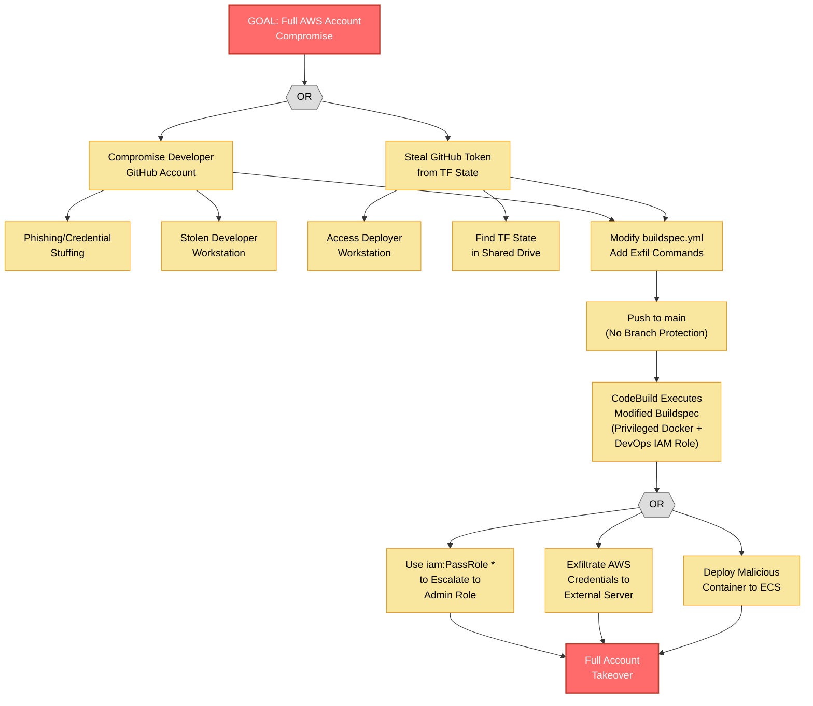
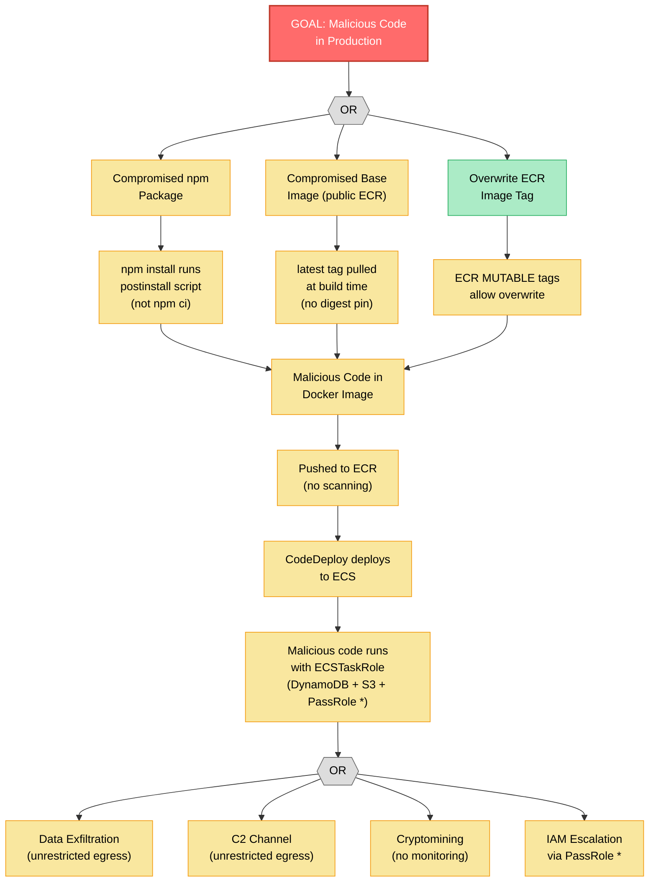

# Security Architect -- Phase 5 False Negative Hunting

## Metadata
| Field | Value |
|-------|-------|
| Agent | security-architect |
| Date | 2026-02-18 |
| Target System | Amazon ECS Fullstack App (Terraform Demo) |
| Scope | Adversarial review of all components, kill chain tracing, insider/supply chain/temporal/cascade analysis |
| Methodology | STRIDE-LM + PASTA + Kill Chain Analysis |
| Scoring System | OWASP Risk Rating |

---

## 1. Re-examination of Low-Risk and No-Findings Components

### CloudWatch (no findings in Phase 3)
CloudWatch receives container logs but has no findings assigned. Re-examining: CloudWatch log groups use default encryption (AWS-owned key) and 30-day retention. No cross-account log shipping, no CloudTrail data event logging for DynamoDB/S3 API calls, no GuardDuty integration. The absence of log analysis and alerting was captured in TM-021, but the absence of CloudTrail data events is a separate gap -- CloudWatch Logs only captures what the application writes to stdout/stderr, not AWS API call audit trails. This is a blind spot for detecting IAM abuse (TM-003, TM-004).

### Autoscaling (no findings in Phase 3)
Autoscaling is configured at 50% CPU/memory with min 1 / max 4. Re-examining: max 4 is trivially overwhelmed, which amplifies TM-007. Additionally, the scaling policy only considers CPU and memory -- not request count or error rate. A sophisticated L7 DoS attack that causes high latency but low CPU/memory usage would not trigger scaling. The min 1 setting also means a single task failure leaves zero capacity until autoscaling responds.

### Security Groups (acknowledged as positive control)
SG_ALB allows 0.0.0.0/0:80 ingress (expected for public ALB). SG_ECS restricts ingress to respective ALB SG only (good). However, egress is unrestricted (`protocol = "-1"` with `0.0.0.0/0`). This means a compromised container can make outbound connections to any destination -- enabling data exfiltration, C2 communication, or cryptocurrency mining. The egress gap was not called out in Phase 3.

### DynamoDB (TM-010, rated LOW)
Re-examining with adversarial mindset: The DynamoDB table uses `docClient.scan()` to return all items. There is no pagination or result limit in the application code. A large table would return all items in a single response. While the current table is small, the scan pattern combined with no rate limiting (TM-007) means an attacker can trigger expensive full-table scans repeatedly, causing DynamoDB throttling or billing spikes on PAY_PER_REQUEST. This is a cost amplification vector separate from TM-007.

---

## 2. Kill Chain Analysis

### Kill Chain 1: Developer Account Compromise to Full AWS Account Takeover

```
TA-2 (Compromised Developer) --> GitHub Push --> Buildspec Modification --> CodeBuild Execution --> IAM PassRole Escalation --> AWS Account Compromise
```

| Step | Action | Phase 3 Coverage | Gap? |
|------|--------|-----------------|------|
| 1. Initial Access | Compromise developer GitHub credentials (phishing, credential stuffing, token theft) | Not explicitly covered -- TM-004 assumes push access but does not model how it is obtained | YES |
| 2. Persistence | Modify buildspec to exfiltrate AWS credentials to external server | TM-004 covers buildspec modification | No |
| 3. Execution | CodeBuild runs modified buildspec with DevOps IAM role | TM-004, TM-013 | No |
| 4. Privilege Escalation | Use PassRole * to create Lambda function with admin role | TM-003 covers PassRole | No |
| 5. Defense Evasion | Delete CloudWatch log stream to remove evidence | Not covered -- DevOps role has CloudWatch Logs permissions (CreateLogGroup, CreateLogStream, PutLogEvents but not Delete) | Partial -- checked, DevOps role does NOT have logs:DeleteLogGroup, so log deletion is not possible. However, logs can be overwritten with noise. |
| 6. Credential Access | Extract other IAM role credentials from ECS task metadata, other Terraform states | Not covered | YES |
| 7. Impact | Full account takeover -- S3 exfiltration, resource destruction, cryptocurrency mining, data ransom | TM-003 impact described | Partial |

**Gap identified**: Step 1 (credential acquisition) and Step 6 (credential harvesting from ECS metadata) were not explicitly modeled. The ECS task metadata endpoint (169.254.170.2) exposes temporary credentials for the task role -- if an attacker achieves code execution in a container, they can extract these credentials and use them from outside the container.

### Kill Chain 2: Supply Chain Compromise via npm Package

```
TA-3 (Supply Chain) --> Compromised npm Package --> CodeBuild install --> Malicious Container Image --> ServerECS Execution --> Data Exfiltration
```

| Step | Action | Phase 3 Coverage | Gap? |
|------|--------|-----------------|------|
| 1. Initial Access | Publish typosquat or compromise popular npm package | TM-015 covers outdated deps; TM-006 covers mutable tags | Partial -- `npm install` vs `npm ci` not called out as distinct finding |
| 2. Execution | Malicious package executes during `npm install` (postinstall script) | Not explicitly covered | YES |
| 3. Persistence | Malicious code embedded in Docker image, pushed to ECR with mutable `latest` tag | TM-006 covers mutable tags | No |
| 4. Collection | Server runs with ECSTaskRole; malicious code scans DynamoDB, lists S3 objects | TM-003 covers IAM permissions | No |
| 5. Exfiltration | Unrestricted egress allows exfiltration to attacker-controlled server | Not covered (egress gap) | YES |
| 6. Defense Evasion | No container scanning, no runtime monitoring, no anomaly detection | TM-014 covers lack of scanning; TM-021 covers monitoring | Partial |

**Gaps identified**: (a) `npm install` vs `npm ci` as a distinct supply chain risk (lockfile integrity bypass), (b) unrestricted egress from ECS tasks enables data exfiltration without detection.

### Kill Chain 3: Internet Attacker to Data Exfiltration via Application Vulnerability

```
TA-1 (Opportunistic) --> Discover Swagger --> Exploit Dependency Vulnerability --> Code Execution in ServerECS --> IAM Credential Theft --> S3/DynamoDB Exfiltration
```

| Step | Action | Phase 3 Coverage | Gap? |
|------|--------|-----------------|------|
| 1. Reconnaissance | Discover Swagger docs at /api/docs, enumerate API surface | TM-016 | No |
| 2. Initial Access | Exploit known vulnerability in Express 4.16.4 or Axios 0.21.2 | TM-015 | No |
| 3. Execution | Achieve code execution in ServerECS container (running as root) | TM-017 (container hardening) | No |
| 4. Credential Access | Read ECS task metadata (169.254.170.2) to obtain ECSTaskRole temporary credentials | Not covered | YES |
| 5. Collection | Use credentials to scan DynamoDB, list/read S3 objects | TM-003 (PassRole enables further escalation) | No |
| 6. Exfiltration | Unrestricted egress allows data transfer to external server | Not covered | YES |

**Gaps identified**: Same egress and metadata credential access gaps as Kill Chain 2.

### Kill Chain 4: Terraform State Theft to Infrastructure Destruction

```
TA-2 (Malicious Insider) --> Workstation Access --> TF State Theft --> GitHub Token --> Buildspec Modification --> Infrastructure Destruction
```

| Step | Action | Phase 3 Coverage | Gap? |
|------|--------|-----------------|------|
| 1. Initial Access | Access deployer workstation (insider access, compromised laptop) | TM-005 covers state file exposure | No |
| 2. Credential Access | Extract GitHub OAuth token from terraform.tfstate | TM-005 | No |
| 3. Lateral Movement | Use token to access GitHub repository, gain code push access | TM-005 chains to TM-004 | No |
| 4. Execution | Modify buildspec and/or Terraform code | TM-004 | No |
| 5. Impact | Run `terraform destroy` (force_destroy=true on S3 buckets), or use pipeline to deploy destructive changes | Not explicitly covered -- terraform destroy path | YES |
| 6. Anti-Recovery | No Terraform state backup, no S3 versioning, no DynamoDB PITR | TM-009, TM-010 cover data store gaps | Partial |

**Gap identified**: The `terraform destroy` path -- with local state, force_destroy on S3, and no state file backup -- enables complete infrastructure destruction with minimal barriers.

### Kill Chain 5: Billing Attack via Autoscaling and DynamoDB

```
TA-1 (Opportunistic) --> Volumetric API Requests --> DynamoDB Throttling/Cost Spike --> ECS Autoscaling --> Uncontrolled AWS Spend
```

| Step | Action | Phase 3 Coverage | Gap? |
|------|--------|-----------------|------|
| 1. Initial Access | Send high volume of GET /api/getAllProducts requests | TM-007 (no WAF/rate limiting) | No |
| 2. Execution | Each request triggers DynamoDB full table scan (docClient.scan) | Not explicitly covered as billing vector | YES |
| 3. Impact | DynamoDB PAY_PER_REQUEST scales with read volume; ECS autoscales to max 4 tasks (increasing compute cost) | TM-007 mentions cost but does not model the billing chain | Partial |

**Gap identified**: DynamoDB full table scan as a cost amplification vector. No billing alarm or cost anomaly detection is configured.

---

## 3. Insider Threat Scenarios

### Rogue Developer Scenario
A developer with GitHub push access can:
1. Modify any source code, Dockerfile, or buildspec
2. Changes flow to production without review (TM-014)
3. Buildspec gives access to DevOps IAM role (TM-004)
4. PassRole * enables privilege escalation (TM-003)

**Phase 3 coverage**: Adequately covered by TM-003, TM-004, TM-014.

### Compromised DevOps Engineer
A DevOps engineer with AWS access can:
1. Access Terraform state (TM-005 -- local state, no encryption)
2. Run `terraform destroy` to destroy all infrastructure
3. Access AWS console to modify IAM policies, S3 buckets, or DynamoDB tables directly
4. No separation between the deployer role and the runtime roles

**Phase 3 gap**: The lack of AWS account-level guardrails (no SCP, no Organizations, no MFA enforcement for destructive operations) was not called out. This is outside the Terraform scope but relevant to the threat model.

---

## 4. Supply Chain Review

| Vector | Status | Phase 3 Coverage |
|--------|--------|-----------------|
| npm packages (postinstall scripts) | `npm install` used, not `npm ci` | TM-015 (partial) |
| Docker base images (`latest` tag from public ECR) | Mutable, unversioned, no digest pinning | TM-006 (covers mutable ECR tags, but base image pinning is separate) |
| Terraform providers | `hashicorp/aws ~> 3.38` -- outdated but pinned to minor range | TM-015 (mentioned) |
| GitHub Actions / Webhooks | Not used -- CodePipeline polls. But GitHub OAuth token scope is unknown | TM-005 (token exposure) |
| CodeBuild build image | `aws/codebuild/standard:4.0` -- AWS managed, but version may have known issues | Not covered |

**New gap**: Base image pinning -- Dockerfiles use `FROM public.ecr.aws/bitnami/node:latest` and `FROM public.ecr.aws/nginx/nginx:latest`. These tags can change at any time. A compromised or buggy base image update would affect the next build automatically.

---

## 5. Temporal Threats

| Threat | Assessment |
|--------|-----------|
| **Key/token rotation** | GitHub OAuth token has no rotation mechanism. Token invalidation requires manual Terraform update. No expiry configured. |
| **Certificate expiry** | No TLS certificates in use (TM-001), so no expiry risk -- but also no protection. |
| **Configuration drift** | Local Terraform state means infrastructure may drift from code without detection. No CI-based terraform plan validation. |
| **Secret sprawl** | GitHub token in state file. AWS credentials on deployer workstation. No centralized secrets management. Over time, these multiply. |
| **Log retention** | 30-day CloudWatch retention. Evidence older than 30 days is lost. No long-term archival to S3. |
| **Dependency decay** | Already outdated dependencies will accumulate more CVEs over time. No automated update process (no Dependabot or similar). |

---

## 6. Cross-Boundary Analysis

| Trust Boundary | Bypass Paths |
|---------------|-------------|
| Internet --> VPC | Direct via ALB (expected). No unexpected bypass paths -- VPC has no public EC2 instances, no VPN, no Direct Connect. |
| Public Subnets --> Private Subnets | Security groups enforce ALB-SG-only ingress. No bypass identified. |
| VPC --> AWS Managed Services | Via NAT GW (HTTPS). No VPC endpoints means no private path. AWS SDK HTTPS prevents tampering, but traffic exits VPC. |
| GitHub --> CI/CD Pipeline | Via OAuth token only. Token compromise enables full pipeline access. No additional verification (IP allowlist, webhook signature validation with secret). |
| CI/CD --> Production Runtime | Build artifacts flow through S3 to CodeDeploy to ECS. No artifact signing, no digest verification, no hash comparison. A modified artifact in S3Pipeline could be deployed. |

**Cross-boundary gap**: The CI/CD to Production boundary has no integrity verification. Build artifacts are stored in S3Pipeline (which lacks encryption and versioning -- TM-009) and deployed without cryptographic verification. An attacker with S3 write access could modify deployment artifacts.

---

## 7. Data Aggregation Risks

Low risk for this system. The data is a public product catalog. Combining product IDs, titles, and image URLs does not produce sensitive information. No user data, no behavioral data, no PII.

---

## 8. Side-Channel Risks

- **Error messages**: Covered by TM-012. DynamoDB errors may reveal table structure.
- **Timing attacks**: Not applicable -- no authentication or comparison operations.
- **Resource consumption patterns**: CloudWatch autoscaling metrics are internal. No externally observable side channels identified.

---

## 9. Cascade Failures

| Failure | Cascade Effect |
|---------|---------------|
| NAT GW failure | All ECS tasks lose outbound connectivity --> DynamoDB, S3, CloudWatch, ECR unreachable --> complete application failure + logging blackout |
| DynamoDB throttling | API returns errors --> frontend shows empty product catalog --> user-facing degradation. No circuit breaker or caching layer. |
| ECR unavailability | New deployments fail (cannot pull images) --> existing tasks continue running (acceptable). But if a task restarts, it cannot pull its image. |
| S3Assets unavailability | Product images fail to load in frontend --> visual degradation but application still functions. |
| CodePipeline failure | No new deployments. No impact on running application. But security patches cannot be deployed. |

The NAT GW cascade is the most severe (TM-018), because it affects all outbound traffic including logging -- meaning the failure itself becomes invisible.

---

## 10. Newly Identified Threats

### TM-022: Unrestricted Egress from ECS Tasks

| Field | Content |
|-------|---------|
| **Threat ID** | TM-022 |
| **Title** | Unrestricted Egress from ECS Tasks Enables Exfiltration and C2 |
| **STRIDE-LM category** | I, LM |
| **Affected component(s)** | ServerECS, ClientECS, SG_ECS |
| **Affected data flow(s)** | ServerECS --> internet (any destination), ClientECS --> internet (any destination) |
| **Cross-framework** | MITRE: T1048 | CWE-269 | OWASP A05:2021 | CIA: C-H |
| **Description** | Security group egress is configured as `protocol = "-1"` (all protocols) with `cidr_blocks = ["0.0.0.0/0"]` (all destinations). A compromised container can freely communicate with any external server for data exfiltration, command-and-control, or cryptocurrency mining. Egress should be restricted to only the required destinations (AWS service endpoints, ALB). |

**Scoring**:
- Threat Actor: TA-3 (Supply Chain), TA-1 (Opportunistic with RCE)
- Attack Path: Achieve code execution in container --> use unrestricted egress to exfiltrate data or establish C2 channel
- Preconditions: Code execution in ECS task (achievable via TM-015 or TM-004 chain)
- Likelihood: **3** (requires initial code execution, then egress is trivial)
- Impact: **4** (enables sustained data exfiltration, C2, and cryptomining; applies to both server and client tasks)
- Risk Score: **12** (HIGH)

### TM-023: No Branch Protection on Repository

| Field | Content |
|-------|---------|
| **Threat ID** | TM-023 |
| **Title** | No Branch Protection Enables Direct Push to Production Branch |
| **STRIDE-LM category** | T, R |
| **Affected component(s)** | GitHub, CodePipeline |
| **Affected data flow(s)** | GitHub --> CodePipeline |
| **Cross-framework** | MITRE: T1195 | CWE-862 | OWASP A08:2021 | CIA: I-H |
| **Description** | No GitHub branch protection rules are enforced (or enforceable) via Terraform. Any developer can push directly to the main branch without pull request review, status checks, or approvals. Combined with TM-004 (buildspec sourced from repo) and TM-014 (no pipeline gates), this creates an uninterrupted path from developer workstation to production. Branch protection is the first line of defense that is entirely absent. |

**Scoring**:
- Threat Actor: TA-2 (Malicious/Compromised Developer)
- Attack Path: Push malicious commit directly to main --> pipeline triggers automatically
- Preconditions: GitHub push access to main branch
- Likelihood: **4** (assumed no branch protection per Phase 1; trivially exploitable by any contributor)
- Impact: **4** (enables TM-004 attack chain; any code reaches production without review)
- Risk Score: **16** (HIGH)

### TM-024: No Billing Alarm or Cost Anomaly Detection

| Field | Content |
|-------|---------|
| **Threat ID** | TM-024 |
| **Title** | No Billing Alarm or Cost Anomaly Detection |
| **STRIDE-LM category** | D |
| **Affected component(s)** | DynamoDB, ServerECS, ClientECS, ServerALB |
| **Affected data flow(s)** | User --> ServerALB --> ServerECS --> DynamoDB |
| **Cross-framework** | MITRE: T1498 | CWE-770 | OWASP API4:2023 | CIA: A-M |
| **Description** | No AWS billing alarm, budget, or cost anomaly detection is configured. An attacker (or bug) that triggers high DynamoDB read consumption (PAY_PER_REQUEST model), excessive NAT GW data transfer, or ECS autoscaling can generate unbounded AWS costs. DynamoDB full table scan on every API request means cost scales linearly with request volume. Without a billing alarm, the account owner may not discover the cost spike until the monthly invoice. |

**Scoring**:
- Threat Actor: TA-1 (Opportunistic)
- Attack Path: Send high-volume GET requests to /api/getAllProducts --> DynamoDB scan costs escalate --> no alarm triggers
- Preconditions: Internet access only
- Likelihood: **4** (trivially triggerable; no rate limiting per TM-007)
- Impact: **3** (financial cost escalation; for a demo account this could be moderate, for a production account potentially significant)
- Risk Score: **12** (HIGH)

### TM-025: npm install Used Instead of npm ci (Lockfile Bypass)

| Field | Content |
|-------|---------|
| **Threat ID** | TM-025 |
| **Title** | npm install in Dockerfiles Bypasses Lockfile Integrity |
| **STRIDE-LM category** | T |
| **Affected component(s)** | CodeBuild, ServerECS, ClientECS |
| **Affected data flow(s)** | npmReg --> CodeBuild |
| **Cross-framework** | MITRE: T1195 | CWE-353 (not in reference set -- manual verification recommended) | OWASP A08:2021 | CIA: I-M |
| **Description** | Both server and client Dockerfiles use `npm install` which can modify `package-lock.json` and install different versions than what was tested. `npm ci` enforces exact lockfile versions and fails if the lockfile is out of sync. Using `npm install` means the build is not reproducible and may pull different (potentially compromised or buggy) dependency versions between builds. |

**Scoring**:
- Threat Actor: TA-3 (Supply Chain)
- Attack Path: 1. Attacker publishes new version of a dependency in the semver-compatible range. 2. `npm install` resolves to the new version (ignoring lockfile). 3. Malicious code executes during install or at runtime.
- Preconditions: A dependency update within semver range that contains malicious code
- Likelihood: **2** (requires a specific supply chain attack targeting a dependency in the semver range)
- Impact: **4** (malicious code runs during build with DevOps role permissions, or at runtime with ECSTaskRole)
- Risk Score: **8** (MEDIUM)

### TM-026: No CloudTrail Data Events for AWS API Auditing

| Field | Content |
|-------|---------|
| **Threat ID** | TM-026 |
| **Title** | No CloudTrail Data Events for DynamoDB/S3 API Auditing |
| **STRIDE-LM category** | R |
| **Affected component(s)** | DynamoDB, S3Assets, S3Pipeline, CloudWatch |
| **Affected data flow(s)** | ServerECS --> DynamoDB, ServerECS --> S3Assets, CodeBuild --> S3Pipeline |
| **Cross-framework** | MITRE: T1562 | CWE-390 | OWASP A09:2021 | CIA: C-L |
| **Description** | No CloudTrail is configured for DynamoDB or S3 data events. API-level access to data stores (who read what, when) is not audited. If ECSTaskRole credentials are stolen (via task metadata endpoint) and used from outside the VPC, there is no audit trail to detect or investigate the abuse. CloudWatch Logs only captures application stdout, not AWS API calls. |

**Scoring**:
- Threat Actor: All actors (gap amplifies other threats)
- Attack Path: Not a direct attack -- an auditing gap that enables undetected exploitation
- Preconditions: N/A
- Likelihood: **3** (the gap exists with certainty; likelihood reflects need for forensic evidence)
- Impact: **2** (reduced detection and investigation capability; does not cause direct damage)
- Risk Score: **6** (MEDIUM)

---

## Attack Tree Diagrams

### Attack Tree 1: GitHub to AWS Account Compromise



### Attack Tree 2: Supply Chain to Production Code Execution



---

## Summary of False Negative Hunting

### Newly Discovered Threats (5)

| ID | Threat | L | I | Score | Severity |
|----|--------|---|---|-------|----------|
| TM-022 | Unrestricted Egress from ECS Tasks | 3 | 4 | 12 | HIGH |
| TM-023 | No Branch Protection | 4 | 4 | 16 | HIGH |
| TM-024 | No Billing Alarm/Cost Anomaly Detection | 4 | 3 | 12 | HIGH |
| TM-025 | npm install vs npm ci (Lockfile Bypass) | 2 | 4 | 8 | MEDIUM |
| TM-026 | No CloudTrail Data Events | 3 | 2 | 6 | MEDIUM |

### Key Kill Chain Insights

1. **GitHub to AWS is a 4-step chain with zero gates**: Developer credentials --> push to main --> buildspec executes --> PassRole escalation. Every step is unobstructed. TM-023 (branch protection) was the missing first-line control.
2. **Unrestricted egress is the enabler for all exfiltration**: TM-022 was missed in Phase 3 because egress was not examined as a distinct finding. It appears in every kill chain as the exfiltration step.
3. **Billing attacks are costless to the attacker**: TM-024 was discovered through the billing kill chain (Kill Chain 5). The combination of no WAF + no rate limiting + DynamoDB scan + PAY_PER_REQUEST + no billing alarm creates an unbounded cost exposure.
4. **Detection gaps compound all findings**: The combination of TM-011 (no flow logs), TM-021 (no monitoring), TM-026 (no CloudTrail) means the defender has almost no visibility. An attacker could compromise the system and operate undetected for the full 30-day log retention window.
